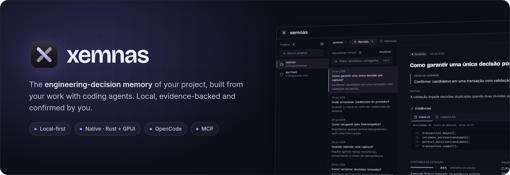
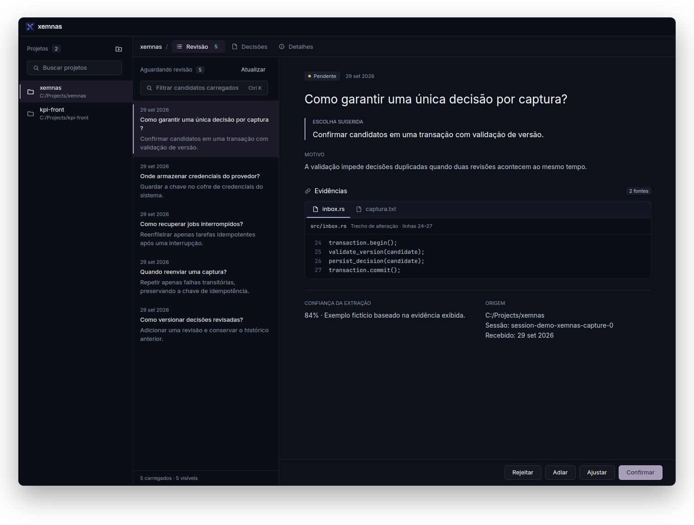
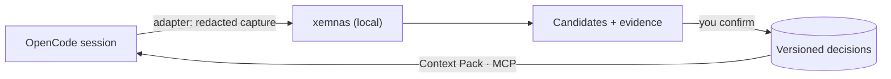
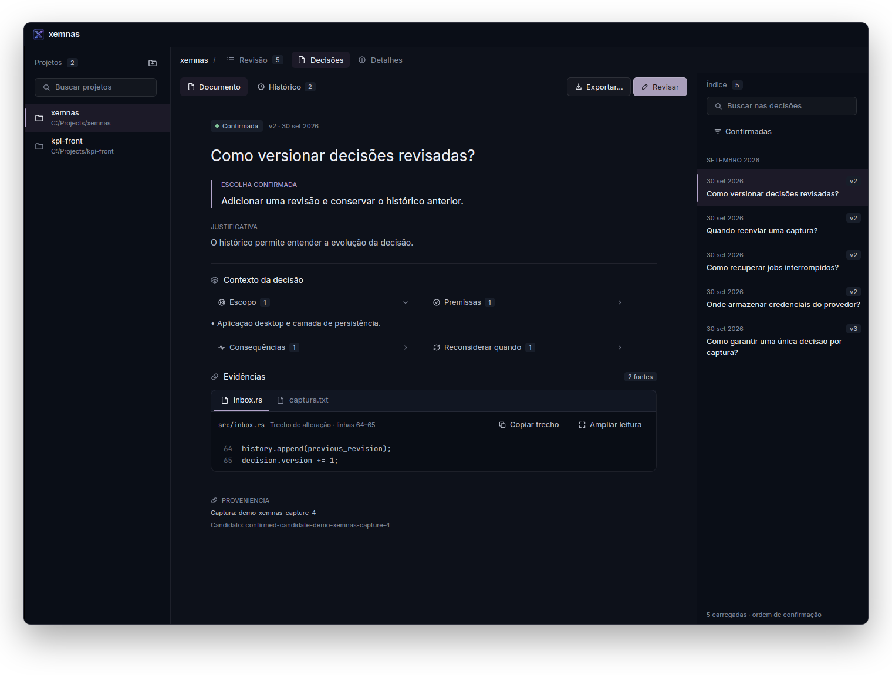
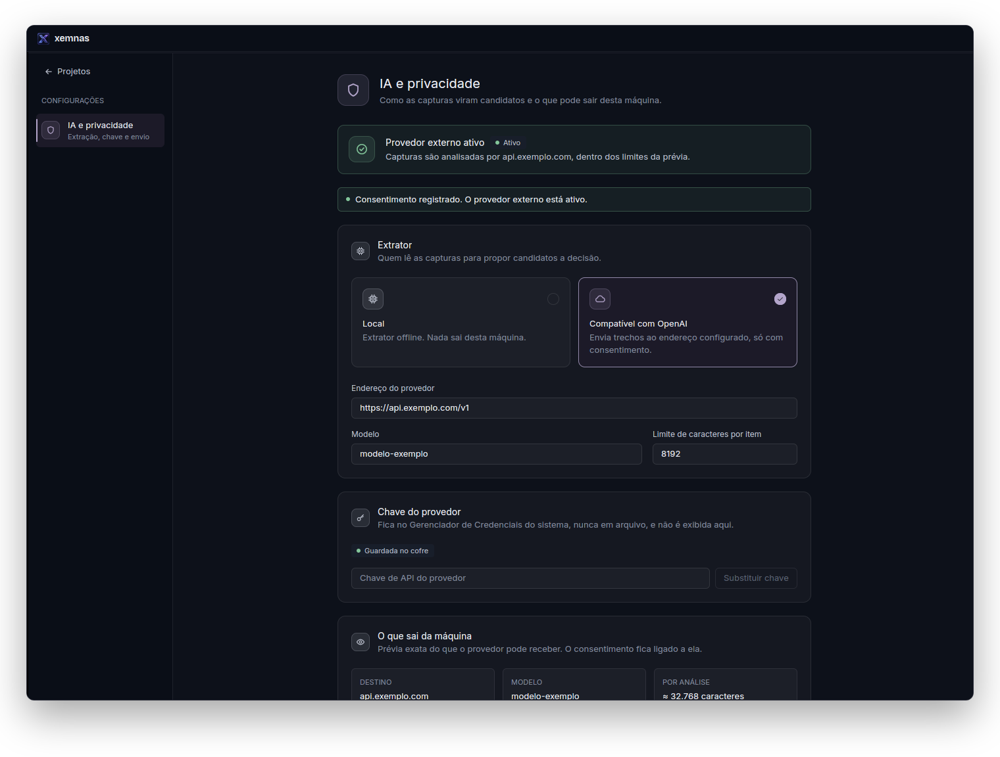

<p align="center">
  
</p>

<p align="center">
  <a href="LICENSE"></a>
  
  
  
</p>

<p align="center">
  <a href="#how-it-works">How it works</a> ·
  <a href="#getting-started">Getting started</a> ·
  <a href="#integrations">Integrations</a> ·
  <a href="#privacy">Privacy</a> ·
  <a href="#architecture">Architecture</a> ·
  <a href="#documentation">Documentation</a>
</p>

---

Coding agents make dozens of decisions per session, and almost all of them get
lost in the chat history. **xemnas** follows that work, proposes the decisions that
showed up in it together with the evidence behind them, and keeps the ones you
confirm as a versioned, searchable memory of the project. That memory flows back
to the agent as context, without the agent ever deciding for you.

<p align="center">
  
</p>

## Highlights

- **Review with evidence.** Each candidate comes with the suggested choice, the rationale and
  the conversation or diff excerpts it came from. You confirm, adjust, defer or reject it.
- **Versioned decisions.** Revising creates a new version and keeps the previous one; every
  decision is searchable, carries its provenance and exports to Markdown or JSON.
- **Project context at a glance.** A Context tab with the decisions in force, the project's
  rules (assumptions, constraints, goals, conventions), how the agent receives them, and a
  preview of the exact pack a task would get.
- **Decisions that relate.** Mark what supersedes, depends on or conflicts with what; a
  superseded decision leaves the agent's context but stays in history.
- **Context back to the agent.** A Context Pack with the decisions in force, plus a read-only
  MCP server the agent can query when it needs to.
- **Honest operations.** A connection test for the OpenCode integration and a diagnostics page
  with latency, losses and retryable jobs, exported without any content.
- **Local by default.** SQLite on your machine and an offline extractor. An external AI provider
  only runs after a preview of what leaves the machine and your explicit consent.
- **Native app.** Rust + [GPUI](https://github.com/zed-industries/zed/tree/main/crates/gpui),
  the UI framework behind Zed. No Electron, no browser.

## How it works



1. **Capture.** The OpenCode plugin sends the session to the app's local API (loopback only),
   with secrets masked before anything is stored. If the app is closed, it waits in a file outbox.
2. **Extraction.** A background job proposes candidates. The default extractor is offline; an
   OpenAI-compatible provider is optional.
3. **Review.** Nothing becomes a decision without you.
4. **Context.** Decisions in force go back to the agent through compact injection (enabled per
   project) or an MCP query.

<table>
  <tr>
    <td width="50%"></td>
    <td width="50%"></td>
  </tr>
  <tr>
    <td align="center"><sub><b>Decisions</b>: document, history, evidence and index</sub></td>
    <td align="center"><sub><b>AI &amp; privacy</b>: extractor, key vault and outgoing preview</sub></td>
  </tr>
</table>

> The interface is currently in Portuguese (pt-BR).

## Getting started

**Requirements:** Windows and stable Rust.

```powershell
git clone https://github.com/pablozr/xemnas
cd xemnas

# Explore with sample data (in-memory database, nothing is written)
cargo run --locked -p desktop-gpui --bin xemnas -- --demo

# Real use
cargo build --release --locked -p desktop-gpui --bin xemnas
.\target\release\xemnas.exe
```

Distributable ZIP: `.\tools\package.ps1`. Demo flags, data locations and the cross build are
covered in [docs/operacao/operacao-e-referencia.md](docs/operacao/operacao-e-referencia.md) (Portuguese).

## Integrations

| | |
| --- | --- |
| **OpenCode** | Plugin in [`adapters/opencode`](adapters/opencode): captures on idle, validates the envelope and sends it to the app or the outbox. No domain rules, never calls a model. [Setup](docs/operacao/operacao-e-referencia.md#integração-com-o-opencode) |
| **MCP** | `xemnas-mcp` ([`apps/mcp-server`](apps/mcp-server)): read-only `get_decision` and `search_context` over stdio. Works with OpenCode and Claude Code. [Setup](docs/roadmap/fase-5/01-mcp-leitura.md) |
| **Context Pack** | Decisions in force and rules valid at a date, with citations and a size budget. [Details](docs/roadmap/fase-3/01-context-pack-manual.md) |

## Privacy

- Data lives in `%LOCALAPPDATA%\xemnas`; the local API listens on loopback only, with a per-session token.
- Secrets are redacted twice before anything is stored: in the adapter and in the Rust engine.
- External AI requires HTTPS (HTTP only on loopback), a preview of what leaves the machine and
  consent bound to that preview. The provider key lives in Windows Credential Manager, never in a file.
- Logs and exported diagnostics never carry conversation content, diffs or credentials.
- xemnas never commits or writes to your repository; exporting is always your action.

## Architecture

A modular Rust monolith whose layering is enforced by an architecture test.

| Path | Role |
| --- | --- |
| `crates/domain` | Domain rules and types, no I/O |
| `crates/application` | Use cases and ports (Inbox, Decisions, Export, Context Pack, AI profile) |
| `crates/storage-sqlite` | SQLite + FTS5, forward-only migrations |
| `crates/local-api` | Local HTTP API for the adapter and for agents |
| `crates/ai-provider` | OpenAI-compatible provider and OS key vault |
| `apps/desktop-gpui` | Desktop app (GPUI) and composition root |
| `apps/mcp-server` | Read-only MCP server |
| `adapters/opencode` | TypeScript plugin for OpenCode |

## Documentation

Project documents are written in Portuguese.

- [MVP specification](docs/produto/MVP-SPEC.md) and [domain vocabulary](docs/produto/CONTEXT.md)
- [Stack and architecture](docs/arquitetura/stack-e-arquitetura-rust-gpui.md) · [ADRs](docs/arquitetura/adr/)
- [Visual identity](docs/design/VISUAL-IDENTITY.md) and [Quiet Glass design system](docs/design/design-system-quiet-glass.md)
- [Operations, local data and known limitations](docs/operacao/operacao-e-referencia.md)
- [Research and future ideas](docs/pesquisas/README.md) · [Full documentation map](docs/README.md)

## Contributing

```powershell
cargo fmt --all -- --check
cargo clippy --workspace --all-targets --locked -- -D warnings
cargo test --workspace --locked
```

CI runs the same checks plus `cargo deny`, `cargo audit`, the adapter tests and packaging.
Small commits, one topic each; see [AGENTS.md](AGENTS.md).

## License

[MIT](LICENSE) © xemnas contributors
