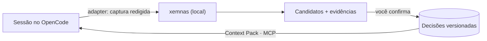

<p align="center">
  
</p>

<p align="center">
  <a href="LICENSE"></a>
  
  
  
</p>

<p align="center">
  <a href="#como-funciona">Como funciona</a> ·
  <a href="#começando">Começando</a> ·
  <a href="#integrações">Integrações</a> ·
  <a href="#privacidade">Privacidade</a> ·
  <a href="#arquitetura">Arquitetura</a> ·
  <a href="#documentacao">Documentação</a>
</p>

---

Agentes de código tomam dezenas de decisões por sessão, e quase todas se perdem
no histórico do chat. O **xemnas** acompanha esse trabalho, propõe as decisões que
apareceram nele com a evidência que as sustenta e guarda as que você confirmar,
como uma memória versionada e pesquisável do projeto. Essa memória volta para o
agente como contexto, sem que ele decida nada por você.

<p align="center">
  
</p>

## Destaques

- **Revisão com evidência.** Cada candidato traz a escolha sugerida, o motivo e os trechos
  de conversa ou diff de onde saiu. Você confirma, ajusta, adia ou rejeita.
- **Decisões versionadas.** Revisar cria uma nova versão sem apagar a anterior; tudo tem
  busca, proveniência e exportação em Markdown ou JSON.
- **Contexto de volta para o agente.** Um Context Pack com as decisões vigentes, e um
  servidor MCP somente leitura para o agente consultar quando precisar.
- **Local por padrão.** SQLite na sua máquina e extração offline. Um provedor de IA externo
  só entra com prévia do que sai e consentimento explícito.
- **App nativo.** Rust + [GPUI](https://github.com/zed-industries/zed/tree/main/crates/gpui), o framework de UI do Zed, sem Electron e sem navegador.

## Como funciona



1. **Captura.** O plugin do OpenCode envia a sessão para a API local do app, só em
   loopback, com segredos mascarados antes de gravar. Com o app fechado, ela espera numa
   fila de arquivos.
2. **Extração.** Um job em segundo plano propõe candidatos. O extrator padrão é offline;
   um provedor compatível com OpenAI é opcional.
3. **Revisão.** Nada vira decisão sem você.
4. **Contexto.** As decisões vigentes voltam ao agente por injeção compacta (ligada por
   projeto) ou por consulta MCP.

<table>
  <tr>
    <td width="50%"></td>
    <td width="50%"></td>
  </tr>
  <tr>
    <td align="center"><sub><b>Decisões</b>: documento, histórico, evidências e índice</sub></td>
    <td align="center"><sub><b>IA e privacidade</b>: extrator, cofre e prévia do envio</sub></td>
  </tr>
</table>

## Começando

**Requisitos:** Windows e Rust estável.

```powershell
git clone https://github.com/pablozr/xemnas
cd xemnas

# Explorar com dados fictícios (banco em memória, nada é gravado)
cargo run --locked -p desktop-gpui --bin xemnas -- --demo

# Uso real
cargo build --release --locked -p desktop-gpui --bin xemnas
.\target\release\xemnas.exe
```

Pacote ZIP distribuível: `.\tools\package.ps1`. Opções da demo, caminhos de dados e o
build cruzado estão em [docs/operacao.md](docs/operacao.md).

## Integrações

| | |
| --- | --- |
| **OpenCode** | Plugin em [`adapters/opencode`](adapters/opencode): captura em idle, valida o envelope e envia para o app ou para a fila de arquivos. Não tem regra de domínio e não chama modelo. [Ativação](docs/operacao.md#integração-com-o-opencode) |
| **MCP** | `xemnas-mcp` ([`apps/mcp-server`](apps/mcp-server)): `get_decision` e `search_context`, somente leitura, sobre stdio. Funciona com OpenCode e Claude Code. [Configuração](docs/fase-5/01-mcp-leitura.md) |
| **Context Pack** | Decisões vigentes e regras válidas numa data, com citações e limite de tamanho. [Detalhes](docs/fase-3/01-context-pack-manual.md) |

## Privacidade

- Dados ficam em `%LOCALAPPDATA%\xemnas`; a API local só escuta em loopback, com token por sessão.
- Segredos são redigidos duas vezes antes de qualquer gravação: no adapter e no motor Rust.
- IA externa exige HTTPS (HTTP só em loopback), prévia do que sai da máquina e consentimento ligado a essa prévia.
  A chave do provedor fica no Gerenciador de Credenciais do Windows, nunca em arquivo.
- Logs e diagnóstico exportado não carregam conteúdo de conversas, diffs ou credenciais.
- O xemnas não faz commit nem escreve no seu repositório; exportar é sempre uma ação sua.

## Arquitetura

Monólito modular em Rust com camadas verificadas por teste de arquitetura.

| Pasta | Papel |
| --- | --- |
| `crates/domain` | Regras e tipos do domínio, sem I/O |
| `crates/application` | Casos de uso e portas (Inbox, Decisões, Export, Context Pack, perfil de IA) |
| `crates/storage-sqlite` | SQLite + FTS5, migrations forward-only |
| `crates/local-api` | API HTTP local para o adapter e para agentes |
| `crates/ai-provider` | Provedor compatível com OpenAI e cofre de credenciais |
| `apps/desktop-gpui` | App desktop (GPUI) e raiz de composição |
| `apps/mcp-server` | Servidor MCP somente leitura |
| `adapters/opencode` | Plugin TypeScript do OpenCode |

## Documentação

- [Especificação do MVP](docs/MVP-SPEC.md) e [vocabulário do domínio](docs/CONTEXT.md)
- [Stack e arquitetura](docs/stack-e-arquitetura-rust-gpui.md) · [ADRs](docs/adr/)
- [Design system Quiet Glass](docs/design-system-quiet-glass.md)
- [Operação, dados locais e limitações conhecidas](docs/operacao.md)

## Contribuindo

```powershell
cargo fmt --all -- --check
cargo clippy --workspace --all-targets --locked -- -D warnings
cargo test --workspace --locked
```

O CI roda esses mesmos checks, mais `cargo deny`, `cargo audit`, os testes do adapter e o
empacotamento. Commits pequenos, um assunto por vez; veja [AGENTS.md](AGENTS.md).

## Licença

[MIT](LICENSE) © contribuidores do xemnas
