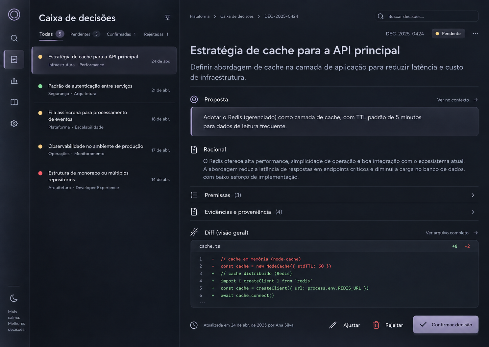

# Quiet Glass Design System

**Status:** direção visual aprovada  
**Superfície inicial:** aplicativo desktop Rust + GPUI  
**Referência visual canônica:** [design-system-reference.png](./design-system-reference.png)



## Essência

Quiet Glass é um sistema visual dark, zen e confortável para sessões longas de trabalho técnico. A sofisticação vem de proporção, tipografia, materiais e precisão — nunca de excesso de elementos.

Cinco princípios são obrigatórios:

1. **Calma antes de densidade:** mostrar somente o necessário para a decisão atual.
2. **Uma superfície contínua:** separar áreas primeiro com espaço, alinhamento e hairlines.
3. **Roxo como reflexo:** lavanda mineral funciona como luz e estado, não como cor dominante.
4. **Glass seletivo:** vidro apenas onde existe mudança real de plano ou interação.
5. **Evidência legível:** conteúdo técnico nunca perde contraste para preservar a estética.

## Personalidade

```text
zen        preciso
calmo      técnico
comfy      profissional
minimal    sofisticado
discreto   confiável
```

Evitar:

```text
cyberpunk
gaming
dashboard SaaS genérico
glassmorphism chamativo
roxo neon
cards em excesso
tipografia editorial/serif
gradientes decorativos
brilhos e sombras dramáticas
```

## Tokens de cor

Os valores abaixo são o ponto de partida para implementação. Devem ser verificados no monitor real e ajustados apenas para contraste ou consistência entre plataformas.

### Base

| Token | Valor | Uso |
|---|---:|---|
| `color.canvas` | `#0D111A` | fundo principal contínuo |
| `color.canvas-raised` | `#111622` | regiões com leve elevação |
| `color.canvas-deep` | `#090D15` | rail e áreas recuadas |
| `color.surface` | `#181E2A` | superfície sólida auxiliar |
| `color.surface-hover` | `#202634` | hover sem glass |
| `color.rail` | `#0A0E17` | rail de navegação, um passo atrás do canvas |
| `hairline.divider` | `rgba(205, 199, 220, 0.10)` | separação interna de 1 px |

`color.rail` fica entre `color.canvas-deep` e `color.canvas`: recua a navegação
sem virar mancha. `hairline.divider` é mais quieto que `glass.border` porque
divisor de altura total pede menos peso que contorno de superfície.

### Glass

| Token | Valor | Uso |
|---|---:|---|
| `glass.fill-low` | `rgba(151, 144, 172, 0.055)` | rail e superfícies amplas |
| `glass.fill-medium` | `rgba(151, 144, 172, 0.095)` | seleção e proposal surface |
| `glass.fill-strong` | `rgba(166, 158, 187, 0.16)` | camada de highlight translúcida de controle primário |
| `glass.fill-emphasis` | `rgba(195, 186, 221, 0.64)` | preenchimento de `Glass Emphasis` (ação primária pequena) |
| `glass.border` | `rgba(205, 199, 220, 0.13)` | contorno geral |
| `glass.border-top` | `rgba(234, 230, 241, 0.20)` | reflexo superior interno |
| `glass.border-bottom` | `rgba(71, 67, 84, 0.28)` | profundidade inferior |
| `glass.surface-lavender` | `#1C1A28` | base controlada de painéis destacados, sem o tom ciano observado nos controles anteriores |
| `glass.edge-lavender` | `#514A63` | contorno mineral suave sobre fundo escuro |
| `glow.lavender` | `rgba(168, 158, 186, 0.08)` | luz difusa de baixa opacidade, restrita a painéis de destaque |

### Lavanda mineral

| Token | Valor | Uso |
|---|---:|---|
| `accent.subtle` | `#82799B` | indicador e borda de seleção |
| `accent.default` | `#9188A8` | foco e ícones ativos |
| `accent.emphasis` | `#A89EBA` | ação primária e foco forte |
| `accent.on-emphasis` | `#15141B` | texto sobre lavanda clara |

O roxo deve ocupar visualmente menos de 8% de uma tela típica. Grandes fundos roxos, glow e gradientes saturados são proibidos.

### Texto

| Token | Valor | Uso |
|---|---:|---|
| `text.primary` | `#ECEEF4` | títulos e conteúdo principal |
| `text.secondary` | `#BEC3D0` | descrições e corpo secundário |
| `text.muted` | `#858C9D` | metadados |
| `text.disabled` | `#5E6574` | estado indisponível |
| `text.inverse` | `#15141B` | controles claros |

### Semânticas

| Token | Valor | Uso |
|---|---:|---|
| `status.success` | `#83C59A` | confirmado ou saudável |
| `status.warning` | `#D4B56E` | pendente ou atenção |
| `status.danger` | `#D96776` | rejeição e erro |
| `status.info` | `#839BBE` | informação neutra |

Cor nunca comunica estado sozinha. Sempre combinar com texto, ícone, posição ou descrição acessível.

## Tipografia

### Famílias

- **Interface:** `Inter Variable`.
- **Código e IDs técnicos:** `JetBrains Mono`.
- **Fallback:** `Segoe UI`, `system-ui`, sans-serif.
- Não usar serif em nenhuma superfície do produto.

### Escala

| Token | Tamanho / linha | Peso | Uso |
|---|---|---:|---|
| `type.display` | `32 / 40` | 560 | título principal de uma decisão |
| `type.heading-1` | `24 / 32` | 600 | título de tela |
| `type.heading-2` | `18 / 26` | 560 | seção principal |
| `type.heading-3` | `15 / 22` | 560 | subsection e row title |
| `type.body` | `15 / 23` | 400 | leitura principal |
| `type.body-small` | `13 / 19` | 400 | descrições compactas |
| `type.label` | `12 / 16` | 520 | labels e controles |
| `type.meta` | `11 / 16` | 450 | datas, IDs e metadados |
| `type.code` | `13 / 20` | 400 | diffs e trechos técnicos |

Regras:

- títulos usam sentence case;
- evitar peso 700 salvo em casos de acessibilidade comprovada;
- largura confortável de leitura: 58–72 caracteres;
- não reduzir corpo abaixo de 14 px em conteúdo decisional;
- tracking quase neutro; não usar títulos excessivamente espaçados.

## Espaçamento e geometria

Base de espaçamento: `4 px`.

```text
space.1  = 4
space.2  = 8
space.3  = 12
space.4  = 16
space.5  = 20
space.6  = 24
space.8  = 32
space.10 = 40
space.12 = 48
space.16 = 64
```

Raios:

```text
radius.control = 8
radius.surface = 10
radius.dialog  = 12
radius.round   = 999
```

Evitar raios maiores que 12 px em painéis do desktop. Elementos não devem parecer bolhas.

## Materiais

### Fundo da janela: opaco (material opcional)

A janela é `WindowBackgroundAppearance::Opaque` por padrão. O material do
Windows (Mica Alt) foi removido por falhas visuais, restaurado em 30/09/2026 com
moldura de vidro e card flutuante, e voltou a ser opcional no mesmo dia: a faixa
de material e a borda do card pareciam um defeito de renderização. Para
experimentar, `XEMNAS_BACKDROP=mica-alt`, `mica` ou `acrylic` ligam o material e
a moldura de vidro (só com o sistema em modo escuro).

**Limite registrado:** GPUI não faz *backdrop blur* por elemento. Superfícies internas (rail, cards, empty state) usam
a receita translúcida + borda + *inset shadow* descrita abaixo. Para vidro
desfocado em superfície interna seria preciso um shader WGSL próprio, fora do
escopo deste design system.

### Canvas

- superfície azul-carvão quase preta;
- variação tonal ambiente muito suave;
- sem wallpaper, ilustração ou gradiente perceptível;
- ruído fino opcional em opacidade inferior a 1.5% para evitar aparência sintética.

### Glass Low

Uso: navigation rail e superfícies amplas secundárias.

```text
fill: glass.fill-low
border: 1 px glass.border
top inner highlight: 1 px glass.border-top com baixa opacidade
shadow: 0 8 28 rgba(0, 0, 0, 0.16)
```

### Glass Selected

Uso: item selecionado e proposal surface.

```text
fill: glass.fill-medium
border: 1 px glass.border
selection edge: 2 px accent.subtle
top inner highlight: discreto
shadow: 0 10 32 rgba(0, 0, 0, 0.18)
```

### Glass Emphasis

Uso: ação primária, nunca painéis grandes.

```text
fill: glass.fill-emphasis (lavanda translúcida sobre color.canvas)
foreground: accent.on-emphasis
inner highlight: 1 px branco a 16%
bottom edge: preto a 16%
shadow: 0 8 22 rgba(0, 0, 0, 0.22)
```

O preenchimento atual usa alfa `0.64`: o botão pequeno conserva destaque sem
virar uma placa lilás. O teste de contraste compõe o token sobre `color.canvas`
e exige pelo menos **4.5:1** para `accent.on-emphasis`. A referência canônica
(`design-system-reference.png`) usava outra lavanda quase opaca; não é o valor
do produto atual. `glass.fill-strong` permanece para a camada de highlight,
não para o corpo do controle.

Estado verificado em: `issues/05-primitives-quiet-glass.md`.

### Fallback técnico

Glass não pode depender obrigatoriamente de blur real. Em plataformas ou cenas onde backdrop blur não estiver disponível ou ficar caro:

- manter fill translúcido sobre canvas controlado;
- usar borda, highlight interno e separação tonal;
- preservar o mesmo contraste;
- nunca bloquear o produto por ausência de blur.

A janela é opaca por padrão; o material só entra por `XEMNAS_BACKDROP`. Superfícies internas continuam com receita própria e previsível.

## Layout desktop

### Superfície atual: Projetos (GPUI)

Esta é a regra vigente para a tela implementada. O layout de Inbox abaixo é
referência para uma superfície futura, não uma função disponível em Projetos.

- A barra superior contém marca, busca editável e controles nativos de janela;
  busca e controles não pertencem à região arrastável. O título da seção aparece
  na lista lateral, não repetido na barra superior.
- A lista de projetos ocupa uma lateral de 322 px; a área selecionada ocupa
  **toda a largura e altura restantes**. Não limitar o detalhe a um card central
  nem preencher o vão com métricas, atividade ou ações sem dados reais.
- O detalhe usa um cabeçalho contínuo de lavanda mineral, propriedades legíveis
  logo abaixo dele e a ação secundária junto às propriedades, dentro da
  primeira área visível. Borda e luz marcam hierarquia,
  não cada bloco. Em janela menor, conteúdo rola sem cortar confirmação ou ação.
- A linha selecionada conserva fundo e indicador lateral sob hover; foco de
  teclado permanece visível e `aria-selected` representa a mesma seleção.
  Trocar de projeto fecha uma confirmação pendente. Ao remover, o foco volta a
  um controle que continua na tela.
- A contagem de projetos aparece uma vez, na lateral; a barra inferior reserva
  apenas a dica de atalho. Busca sem resultado não mostra detalhe fora do filtro.
- Seletor cancelado não altera a lista. Registro duplicado e falhas apresentam
  mensagem em linguagem de produto; remover da lista nunca remove a pasta.

**Gate deste passe:** conferir projeto selecionado, seleção sob hover, foco,
confirmação, caminho longo e janela reduzida na janela GPUI real. Compilação
não substitui essa inspeção visual; não alegar blur por componente sem suporte
real do backend.

### Referência futura: Inbox e leitura

Referência para janela de `1440 × 1024`:

| Região | Medida |
|---|---:|
| Navigation rail | `72–88 px` |
| Decision Inbox | `400–450 px` |
| Reading workspace | restante, mínimo `640 px` |
| Margem de conteúdo | `32–48 px` |
| Largura máxima de leitura | `880 px` |

Regras:

- rail e Inbox podem recolher progressivamente;
- não manter três painéis detalhados simultaneamente;
- a decisão selecionada é sempre o foco dominante;
- breadcrumbs e busca ocupam pouco peso visual;
- ações principais ficam previsíveis no canto inferior direito;
- detalhes secundários usam progressive disclosure.

### Densidade por tela

"Calma antes de densidade" é a ordem, não uma licença para o vazio. Uma tela
com um único item não pode deixar o vão restante como área morta; a estrutura
precisa preenchê-lo com algo que tenha função.

| Elemento | Onde | Medida |
|---|---|---|
| Barra de status | rodapé da janela | `28 px` quando houver informação ou atalho útil; não duplicar a contagem lateral |
| Rail | lateral esquerda | `88 px`, altura total |
| Cabeçalho de página | topo da coluna de conteúdo | `type.heading-1` + descrição |
| Margem de conteúdo | em volta do eixo | `space.8` a `space.10` |

Uma tela vazia tem três apoios possíveis, nesta ordem de preferência:

1. a **barra de status** reportando estado de runtime;
2. o **empty state** com o próximo passo real da tela;
3. a estrutura visível (rail, cabeçalho, divisores) fechando o vão.

O que não é permitido é o vão acidental: conteúdo que para no meio da janela
sem nenhuma borda que explique onde ele termina.

Janela mínima da referência futura recomendada: `1180 × 760`. Abaixo disso, Inbox vira overlay ou fica recolhida. Não aplicar essa regra automaticamente à tela atual de Projetos.

## Componentes fundamentais

### Navigation Rail

- largura compacta;
- ícones de 18–20 px;
- área clicável mínima de 40 × 40 px;
- ativo dentro de um recessed glass well;
- tooltip obrigatório quando sem label;
- agrupamentos reduzidos e consistentes.

### Decision Inbox Row

- lista contínua, não card grid;
- título, escopo e data;
- status por pequeno dot + descrição acessível;
- hover apenas tonal;
- seleção usa `Glass Selected` e edge de 2 px;
- altura confortável entre 76 e 92 px.

### Proposal Surface

- uma única surface em glass;
- label e ícone fora ou alinhados à borda superior;
- texto principal com alto contraste;
- edge lavanda discreta;
- nenhuma decoração sem função.

### Disclosure Row

- usado para Premissas, Evidências e seções extensas;
- altura mínima de 48 px;
- hairlines horizontais;
- chevron discreto;
- expand/collapse preserva contexto visual;
- contador aparece como texto, não badge colorido.

### Diff Viewer

- fundo quase sólido para leitura;
- JetBrains Mono 13/20;
- vermelho e verde dessaturados;
- números de linha com contraste reduzido;
- ações secundárias fora do código;
- scroll e seleção de texto previsíveis.

### Primary Button

- uma ação primária por tela;
- Glass Emphasis;
- altura 44–48 px;
- padding horizontal 20–24 px;
- ícone opcional de 16–18 px;
- não usar glow;
- estado pressed diminui highlight e elevação.

### Quiet Action

Uso: Ajustar, rejeitar, copiar e abrir fonte.

- começa como ícone + label sem container visível;
- hover recebe tint muito leve;
- danger só colore ícone/texto no hover ou quando necessário;
- área clicável nunca menor que 40 px.

### Search Field

- Glass Low;
- altura 36–40 px;
- placeholder muted;
- borda fica lavanda apenas em foco;
- atalho de teclado aparece somente quando útil.

## Estados

Todo componente interativo implementa:

```text
rest
hover
focus-visible
pressed
selected
disabled
loading quando aplicável
error quando aplicável
```

Focus-visible:

- ring externo de 2 px `accent.emphasis`;
- offset de 2 px;
- contraste visível contra canvas e glass;
- nunca remover o ring por estética.

## Movimento

Movimento deve explicar mudança, não decorar.

```text
motion.fast   = 100 ms
motion.base   = 160 ms
motion.slow   = 240 ms
easing.enter  = cubic-bezier(0.16, 1, 0.3, 1)
easing.exit   = cubic-bezier(0.4, 0, 1, 1)
```

Usos:

- hover e pressed: `100 ms`;
- seleção e disclosure: `160 ms`;
- pane/overlay: `200–240 ms`;
- sem parallax, pulso contínuo ou shimmer permanente;
- respeitar reduced motion removendo deslocamento e mantendo somente fade curto.

#### Curvas disponíveis neste rev do GPUI

O GPUI fixado (rev `2440236`) expõe apenas `linear`, `quadratic`, `ease_in_out`
e `ease_out_quint` — não há avaliador de `cubic-bezier`. A correspondência usada
hoje:

| Token | Curva pedida | Curva implementada | Por quê |
|---|---|---|---|
| `easing.enter` | `cubic-bezier(0.16, 1, 0.3, 1)` | `ease_out_quint` | partida rápida e assentamento longo, sem overshoot — um controle nunca passa do estado de repouso |
| `easing.exit` | `cubic-bezier(0.4, 0, 1, 1)` | `ease_in_out` | mesma forma da curva pedida: lenta, rápida, lenta |

Os valores de `cubic-bezier` continuam registrados acima como a intenção de
design. Se um rev futuro do GPUI expuser o avaliador, trocar
`MotionTokens::enter_easing` / `exit_easing` em `ui/tokens.rs` é o único ponto
de mudança.

## Ícones

- outline consistente entre 1.5 e 1.75 px;
- formas simples e cantos discretamente arredondados;
- tamanhos padrão: 16, 18 e 20 px;
- evitar ícones preenchidos, salvo status crítico;
- não usar emoji como ícone de produto;
- escolher uma única biblioteca e não misturar famílias.

## Acessibilidade

- texto normal atende WCAG AA, com alvo de 4.5:1;
- texto grande e ícones essenciais atendem pelo menos 3:1;
- nenhum texto essencial sobre translucidez instável;
- teclado alcança todos os controles em ordem lógica;
- estados possuem nome acessível;
- status não depende apenas de cor;
- glass recebe fallback mais opaco em alto contraste;
- zoom de texto não corta decisões ou ações;
- Narrator é gate obrigatório do vertical slice no Windows.

## Linguagem de produto

- frases curtas e diretas;
- sentence case em títulos e botões;
- evitar linguagem promocional;
- preferir verbos explícitos: `Confirmar decisão`, `Ajustar`, `Rejeitar`;
- diferenciar proposta de fato: `Proposta`, `Evidência`, `Premissa`;
- confiança deve explicar sua origem e nunca aparecer como decoração.

## Regras para agentes implementadores

1. Usar a imagem canônica como referência de hierarquia, densidade e material.
2. Implementar tokens antes de componentes específicos de tela.
3. Nunca usar valores de cor soltos dentro de views GPUI.
4. Nunca recriar glass independentemente em cada componente; usar primitives comuns.
5. Não adicionar cards para resolver espaçamento.
6. Não introduzir novas cores de destaque sem atualizar este documento.
7. Não usar blur se reduzir legibilidade ou fluidez; aplicar o fallback sólido.
8. Verificar teclado, foco, contraste e escala antes de considerar um componente pronto.
9. Comparar screenshots de implementação com a imagem canônica na mesma resolução.
10. Mudanças de identidade visual exigem decisão explícita, não “melhoria” local.

## Primitives GPUI sugeridas

```text
Theme
ColorTokens
TypeScale
SpacingScale
RadiusScale
MotionTokens

GlassSurface
FocusRing
IconButton
QuietButton
PrimaryButton
SearchField
NavigationRail
InboxRow
StatusDot
DisclosureRow
ProposalSurface
DiffViewer
Tooltip
Toast
Dialog
```

`GlassSurface` deve esconder cálculo de fill, strokes, highlight e fallback. As telas escolhem apenas uma variante: `Low`, `Selected` ou `Emphasis`.

## Definition of done visual

Um componente está pronto quando:

- usa apenas tokens aprovados;
- possui todos os estados relevantes;
- funciona com teclado;
- possui nome/estado acessível;
- mantém contraste sobre glass e fallback;
- não causa frame drops perceptíveis;
- possui screenshot nos estados principais;
- foi comparado à referência canônica;
- não adiciona ruído visual desnecessário.
