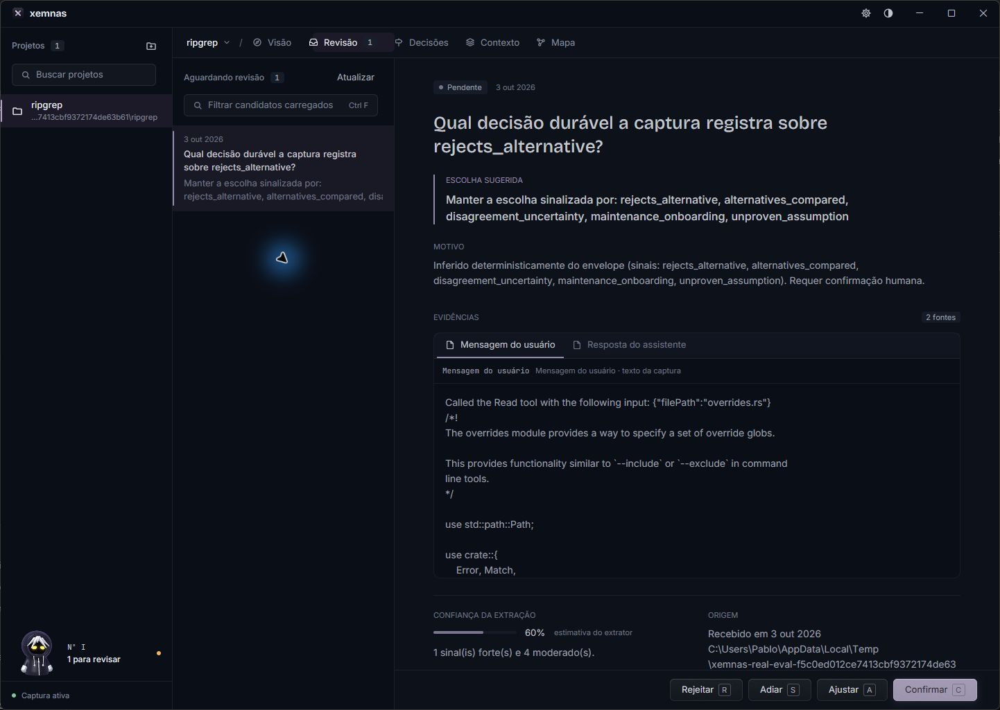
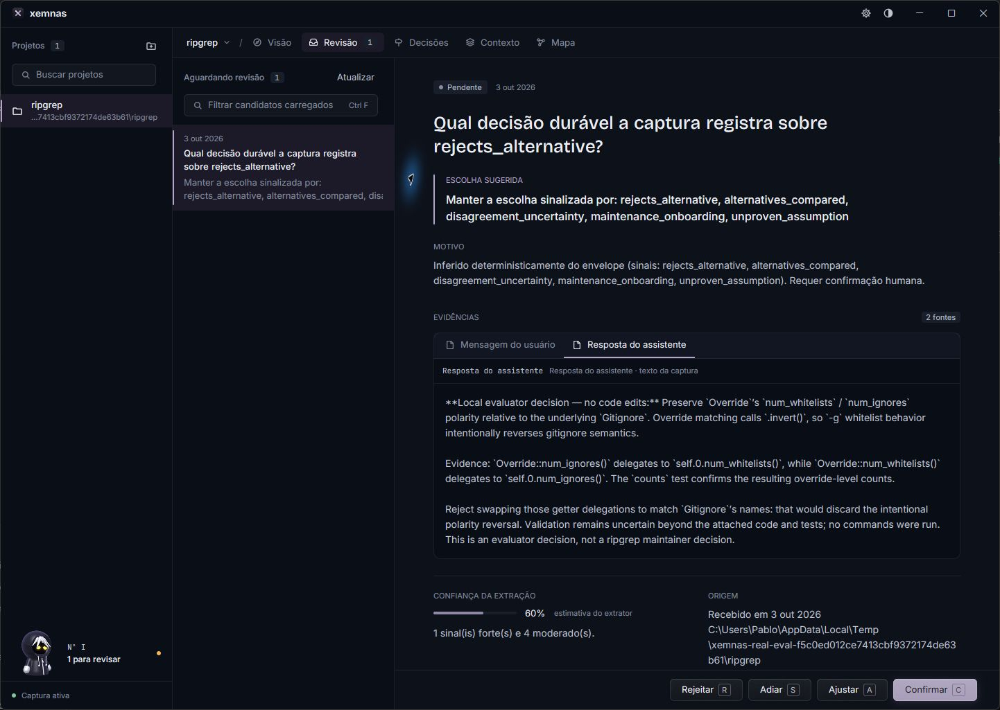
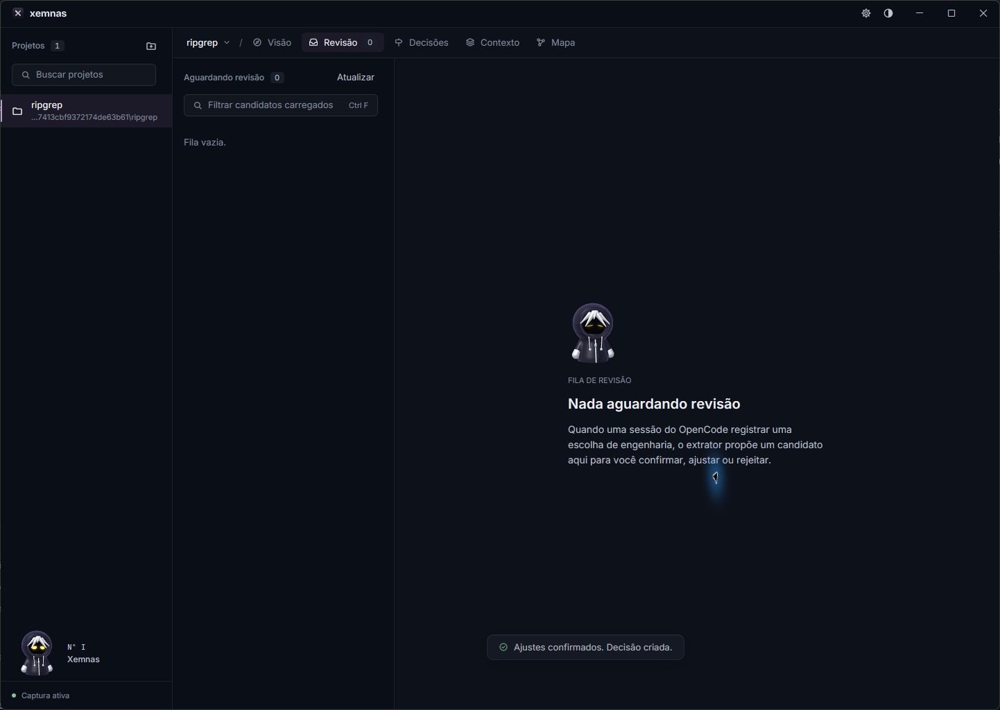
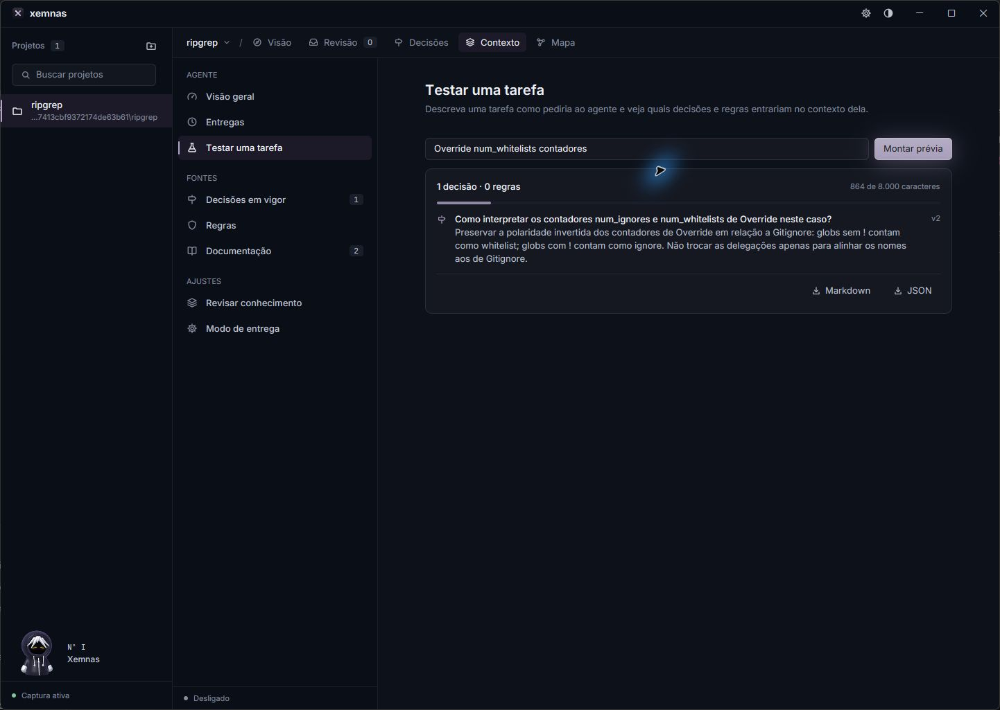
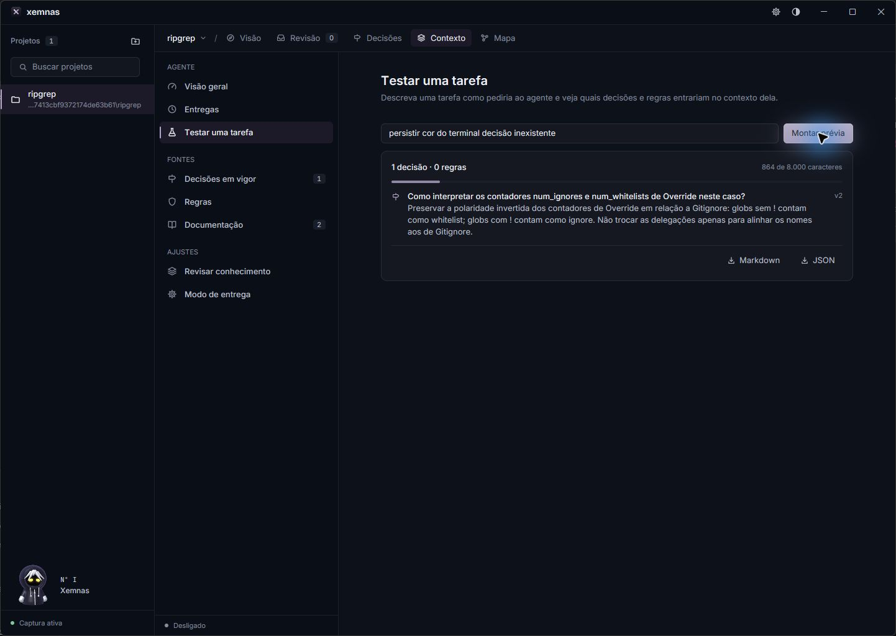
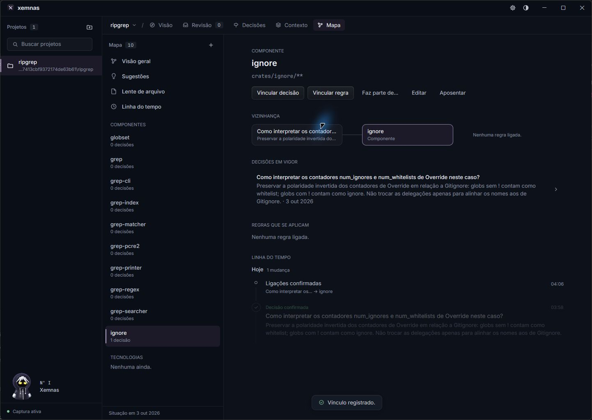
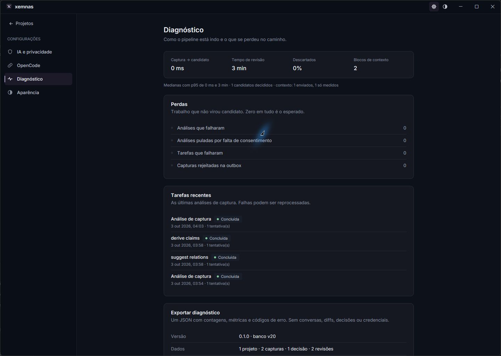
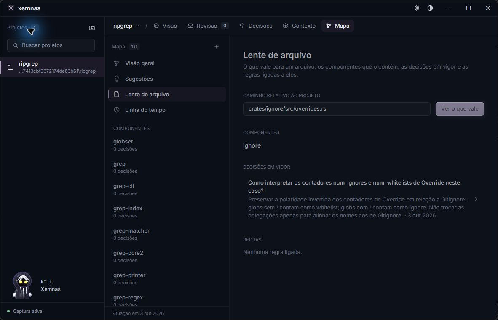
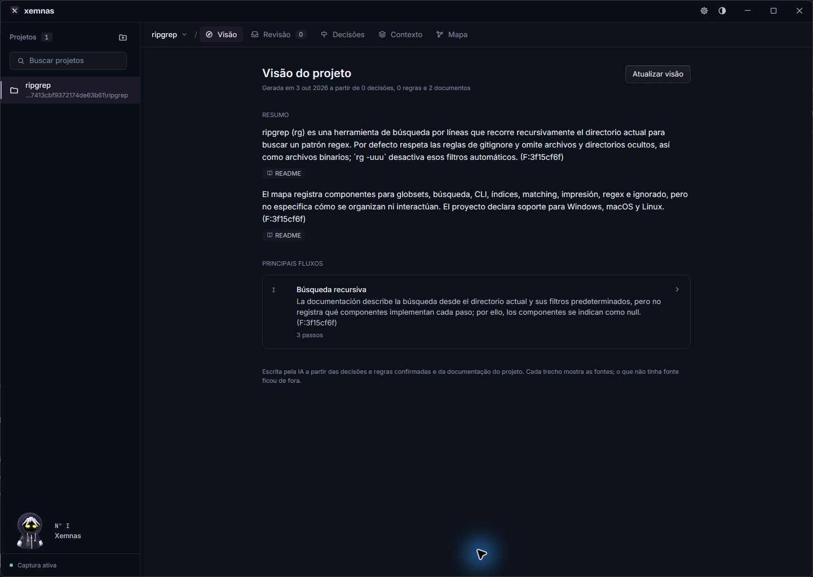

# Avaliação do Xemnas em repositório real

**Data:** 03/10/2026
**Modelo nas críticas e na sessão de injeção:** GPT-6 Luna medium.
**Escopo:** experiência de onboarding, captura/revisão, busca e contexto, mapa/visão, exportação, diagnósticos, OpenCode, adapter/outbox e controles de conhecimento.
**Status:** Parecer e cinco críticas concluídos. A solicitação de exercitar todas as ferramentas permanece incompleta: os cenários sem validação estão enumerados abaixo e a execução final foi bloqueada pelo Windows.

## Meu parecer: eu usaria?

Eu usaria em um piloto supervisionado para recuperar razões de decisões que normalmente ficam perdidas em sessões. Ainda não confiaria nele como fonte automática habitual para orientar alterações. Existe utilidade real, mas ela depende de registrar a informação certa, revisar sua proveniência e entregar somente contexto relevante. Nesta rodada foi preciso reescrever o candidato offline e criar um vínculo manual; uma consulta sem relação trouxe a mesma decisão. Isso torna o ganho frágil para uso diário.

O projeto tem um núcleo mais consistente que sua experiência inicial sugere: ingestão transacional, histórico, isolamento por projeto e entrega de contexto funcionaram nos cenários observados. A promessa mais valiosa é lembrar **por que uma escolha foi feita e qual alternativa foi rejeitada** no momento de uma nova mudança. Eu investiria primeiro em fidelidade, recuperação e instalação. Um grafo maior, mais personalização ou outro assistente não resolveriam as dificuldades encontradas.

Não demonstramos vantagem de conteúdo sobre um ADR bem escrito. Um sexto Luna, sem ler as críticas, recebeu apenas o JSON exportado e respondeu corretamente às cinco perguntas do controle. O diferencial potencial do Xemnas é capturar, manter e entregar essa informação na hora certa com menos trabalho. A entrega foi demonstrada; a redução total de esforço ainda não.

## Resultado

O valor mais claro nesta rodada foi retomar uma decisão local do avaliador: o Xemnas recuperou a regra, o motivo e a ressalva de validação por MCP e, depois de uma ligação manual do arquivo ao mapa, também por `file_context`. Uma sessão real do OpenCode com Luna medium recebeu a decisão injetada e respondeu com a referência e seu escopo local. Isso demonstra um caminho útil de recuperação em um cenário estreito, não um ganho geral de produtividade ou cobertura do código.

A avaliação também expôs uma diferença importante entre demonstração offline e análise consentida com modelo: o `FakeExtractor` offline criou um candidato com sinais altos para a mesma conversa; a análise real via perfil OpenAI compatible/Luna classificou a proposta como `detail`, com confiança 0,99 e significância 0,1, e não criou candidato conforme a política local de relevância. Esse resultado não prova falha de extração arquitetural: a conversa tratava de uma rotina/teste local. O risco do produto está na interpretação do estado vazio e na confiança que uma pessoa pode atribuir a candidatos de demonstração. A UI deveria tornar visíveis os descartes, seu motivo e o limite entre “nada durável encontrado” e “captura não processada”.

As outras limitações observadas são relevantes: uma consulta negativa trouxe decisão sem relação suficiente; a busca em inglês não encontrou a regra que consultas em português encontraram; a visão gerada foi limitada à documentação e exibiu texto em espanhol; o mapa inicial tinha componentes sem responsabilidades nem relações. As críticas estão em arquivos separados para preservar perspectivas e limites de cada avaliação: [onboarding](avaliacao-repositorio-real/critic-onboarding.md), [captura e revisão](avaliacao-repositorio-real/critic-evidence.md), [mapa e grafo](avaliacao-repositorio-real/critic-architecture.md), [recuperação](avaliacao-repositorio-real/critic-retrieval.md) e [operações](avaliacao-repositorio-real/critic-operations.md).

## Projeto, tarefa e condições de comparação

Foi usado um clone raso de [BurntSushi/ripgrep](https://github.com/BurntSushi/ripgrep), commit `3fce3b5bb0236da2df6d99672afb8a719642eca7`: 237 arquivos versionados, 110 arquivos Rust e dez membros Cargo. A tarefa foi investigar a polaridade de `Override::num_ignores/num_whitelists`, rejeitar uma troca intuitiva dos getters e escrever um pequeno teste de contadores no clone descartável. A escolha registrada pertence ao avaliador; não foi atribuída aos mantenedores. Não houve contribuição, push ou PR upstream.

As primeiras capturas reais da sessão foram feitas com arquivos anexados, pois a primeira tentativa não disponibilizou a leitura de arquivos ao modelo. O teste escrito no clone não foi executado: o Windows bloqueou o build script de uma dependência. Portanto, o racional recuperado tem evidência de código e uma ressalva explícita de validação. O transcript reconstruído em `captura-source.json` não foi utilizado como prova de captura real do plugin.

O checkout Xemnas avaliado tinha HEAD `e5c0542` (as duas alterações anteriores eram documentação). Não foram implementadas correções de produto nesta avaliação. O binário compartilhado foi recompilado por outra sessão durante a execução prolongada; a etapa final detectou divergência de tela, recompilou este checkout e registrou SHA-256 `F9CB06F32C2BFB5BD94D23EFCF4D0132E3E480840FDD083ADA627AD7C55157AC`. Sua execução foi bloqueada pelo Controle de Aplicativo. As telas tardias divergentes não são usadas para concluir comportamento desta versão; esse fato impede declarar a rodada exaustiva ou uniformemente reproduzida no binário final.

## Como a avaliação foi feita

Cinco críticas independentes, todas com GPT-6 Luna medium, analisaram onboarding, qualidade da captura/revisão, mapa/grafo, recuperação e operações. Houve consulta read-only a um harness sobre dados isolados, execução real da interface pelo coordenador, screenshots, exportação de diagnóstico, uso do adapter OpenCode em uma sessão real e uma análise de captura com provider real via bridge de teste loopback. Os relatos originais e os resumos sanitizados estão na pasta `avaliacao-repositorio-real/`.

As capturas da UI são evidência de estados mostrados. Os JSONs de harness/diagnóstico são evidência dos casos de uso e do armazenamento temporário, não substituem prova de uma interação humana completa. `review_time_ms = 225000` veio do contador da aplicação e não é benchmark de tempo humano. A análise do primeiro candidato usou `FakeExtractor` offline. A chamada de Luna que injetou contexto foi real; a chamada do provider Xemnas para a captura passou por um bridge temporário que encaminhava ao OpenCode local. Não equivale ao endpoint nativo empacotado como integração de produção.

## Matriz das capacidades

Os nomes seguem o inventário migrado para [inventario-capacidades.md](avaliacao-repositorio-real/inventario-capacidades.md). “Realizado” significa que o cenário estreito foi exercitado; não significa cobertura completa. “Sem validação” significa que não há evidência suficiente nesta rodada, não que o recurso esteja quebrado.

| Capacidade | Estado | Evidência observada e limite |
| --- | --- | --- |
| Acompanhar, selecionar, abrir e remover projetos | Parcial | Projeto de avaliação foi selecionado e usado pela UI/harness; cadastro pelo seletor nativo validou o diretório corretamente. Remoção e purga não foram avaliadas. |
| Revisar candidatos | Parcial | Captura e evidências foram exibidas, candidato editado e confirmado na UI. Foram exercitados adiar, editar e confirmar; rejeição não foi completada. Esse primeiro candidato veio do `FakeExtractor`; o provider real não criou candidato para a proposta de rotina local. |
| Adotar candidato e vínculos sugeridos | Sem validação | Houve confirmação de candidato e, em etapa separada, criação manual de um vínculo no mapa. Não há prova de que o fluxo de adoção com prévia/link tenha sido exercitado. |
| Pesquisar, ler e revisar decisões | Realizado | Decisão confirmada, detalhe, edição/revisão e histórico foram mostrados; a revisão posterior de escopo gerou versão 2 sem perder a versão 1. |
| Exportar decisão | Realizado | A prévia Markdown foi vista e o arquivo JSON foi gravado pelo diálogo GUI e validado (2.908 bytes, versão 1). A exportação Markdown em arquivo e a exportação posterior da versão 2 não foram concluídas. |
| Construir/exportar pacote de contexto | Parcial | Consulta positiva e um falso positivo foram observados. Shadow reportou `context=null`, 1 item e 124 tokens; não foi feita uma matriz de orçamento/omissões ou verificação completa de exportação do pacote. |
| Consultar contexto e injetar em agente | Realizado | OpenCode real com Luna medium recebeu a decisão e sua ressalva; a resposta usou a referência `D:87ee609d`. A entrega usou o adapter real do OpenCode e a API de contexto; a busca textual não depende do vínculo manual. O bridge foi usado somente nos testes posteriores de provider para extração/Visão. |
| Ferramentas MCP de leitura | Realizado | Busca e `get_decision` recuperaram a decisão; `file_context` inicialmente veio vazio e passou a retornar o bloco depois do vínculo manual. Foram testados casos específicos, não todas as falhas/projetos. |
| Capturar sessão OpenCode | Realizado | O adapter real leu uma sessão, construiu envelope e o guardou na outbox quando o resolver do endpoint foi deliberadamente fault-injected para indisponível. Isso não demonstra que o desktop estava realmente offline. |
| Ingerir captura e analisar job | Parcial | Após reiniciar o desktop, o envelope da outbox foi aceito e `analyze_capture` terminou em uma tentativa; assessment via Luna foi `ok` com zero candidatos. O provider foi encaminhado pelo bridge de avaliação, não pela integração nativa empacotada. |
| Revisão de conhecimento | Parcial | Estado de inspeção local e prévia semântica foram mostrados. Não há nesta rodada resultado de revisão semântica executada; o perfil no export GUI era fake/offline. |
| Ver/propor/indexar documentos | Parcial | Dois documentos foram identificados na execução da Visão, com citações exibidas para README; o caminho completo de propor, reindexar e ligar documentos não foi avaliado. |
| Claims e sugestões de claims | Parcial | Harness criou e retirou claim em armazenamento isolado; o fluxo de claims no desktop e uma sugestão gerada/revisada não foram validados ponta a ponta. |
| Mapa/grafo e relações | Parcial | Mapa inicial mostrou dez componentes sem arestas úteis; uma relação manual foi criada. `file_context` passou a recuperar a decisão após o vínculo. A descoberta automática dos dez componentes foi observada; edição/retirada de entidades e confirmação/rejeição de sugestões de relações não foram concluídas. |
| Visão do projeto | Parcial | Geração real completou e persistiu uma visão: duas fontes documentais, zero decisões/regras, dez componentes mapeados e um fluxo de três passos. Passos ficaram sem entidades; texto veio em espanhol, apesar das fontes de interface/docs em português/inglês. A visão descreveu filtros documentados, sem explicar arquitetura/interações do código. |
| Assistente embutido | Parcial | Briefing apareceu na UI. Não foi comprovada conversa livre gerada pelo assistente embutido nem a cobertura de todas as rotas. A resposta da Luna veio da sessão OpenCode. |
| Configurar aparência e provider | Parcial | Cinco temas foram alternados, fundo foi testado e a janela foi reduzida a 1.182 × 761 px; Ctrl K abriu a paleta e navegou à revisão. Provider local e conexão OpenCode também foram inspecionados. O provider de avaliação foi configurado para o cenário loopback; não é prova de instalação/configuração generalizável. |
| Consentimento e prévia | Parcial | A chamada real usou perfil de avaliação enabled com hash de prévia registrado; não houve varredura de todos os dados enviados nem teste completo de revogação/troca de perfil. |
| Diagnóstico, outbox e jobs | Parcial | Export GUI mostrou contagens e quatro jobs completos no snapshot inicial. Uma captura fault-injected percorreu `pending → accepted` e job completou. Recovery com zero jobs não prova recuperação de job falho; retry de um job Failed real não foi testado. |
| Exportar diagnóstico | Realizado | JSON de export GUI corresponde a uma tela de diagnóstico real e não contém segredo. É um snapshot anterior à última ingestão, logo outbox=0 não contradiz a aceitação posterior. |

## Cinco críticas independentes

1. **Onboarding:** desenvolvedor experiente não recebe um caminho curto e verificável para a primeira captura. A documentação exige toolchain, plugin e reinício; estado vazio explica o que falta, mas não confirma conexão/etapas. O teste `--help` iniciou um processo invisível, mas como startup não foi auditado, não se conclui que acessou dados padrão. A crítica inteira: [critic-onboarding.md](avaliacao-repositorio-real/critic-onboarding.md).
2. **Captura e revisão:** os artefatos continham uma decisão local explícita, mas o candidato Fake era uma lista de sinais, não uma escolha clara; confiança e significância não explicavam evidência e validação separadamente. O usuário precisou reescrever para confirmar. A decisão final preservou o limite “local do avaliador, não orientação dos mantenedores”. Ver [critic-evidence.md](avaliacao-repositorio-real/critic-evidence.md).
3. **Mapa e grafo:** o estado inicial continha diretórios Cargo como componentes, descrições ausentes e zero relações. Isso foi útil como índice de pastas, mas não explicou responsabilidades nem fluxo. O mapa ganhou valor limitado após vínculo manual de arquivo. Ver [critic-architecture.md](avaliacao-repositorio-real/critic-architecture.md).
4. **Recuperação:** a busca em português encontrou uma decisão útil; consulta sobre “cor do terminal” trouxe um falso positivo; busca “polarity counters” em inglês não encontrou a decisão. `file_context` só passou a funcionar depois de vínculo manual. `D:<UUID>` não foi aceito, mas a avaliação não estabelece que UUID seja um formato prometido: não classificar isso como bug comprovado. Ver [critic-retrieval.md](avaliacao-repositorio-real/critic-retrieval.md).
5. **Operações:** diagnostics e transições de domínio foram consultáveis; a outbox real aceitou o envelope e o job concluiu. Não houve job Failed nem retry de falha real. Debug, chamadas arbitrárias ignoradas, erro de UTF-8 no transporte e bloqueio do Controle de Aplicativo foram limitações do harness/ambiente, não defeitos do produto. Ver [critic-operations.md](avaliacao-repositorio-real/critic-operations.md).

## Fluxo real de sessão, outbox e provider

O adapter OpenCode real leu um turno recente e escreveu um envelope para a outbox com o resolver do servidor deliberadamente configurado para indisponível. Depois da reinicialização do desktop, o item passou de pendente a aceito e o job `analyze_capture` completou em uma tentativa. A análise foi executada com perfil `open_ai_compatible`, modelo `gpt-6-luna`, assessment `ok`, sem erro e sem candidato. O bridge temporário encaminhou a chamada ao OpenCode local/Luna medium; a duração observada foi **6,753 segundos** (6.753 milissegundos), não uma medida de latência de produto estável. Este setup prova integração de fluxo em cenário controlado, não que a aplicação estivesse realmente offline no primeiro passo, nem que a integração provider/OpenCode com bridge faça parte do produto distribuído.

O modelo classificou a proposta como `detail`, confiança 0,99 e significância 0,1, em linha com a regra que descarta rotina de função/arquivo único. A avaliação não deve promover automaticamente esse resultado a “falso negativo”: para testar cobertura arquitetural seria necessário um exemplo com decisão durável explícita e evidência de responsabilidades/relações, além do detalhe local. O resultado deve aparecer ao operador com motivo de descarte e com distinção clara do candidato Fake da demo.

Uma segunda operação real de Visão gerou e persistiu sumário/fluxo baseado em dois documentos. O texto ficou em espanhol e a etapa não associou as etapas às dez entidades disponíveis. O coordenador observou duas chamadas de provider no período (8,94 s e 4,147 s); a segunda pode corresponder ao job automático de indexação de documentos, portanto não se atribuem ambos os tempos a uma única geração. Esse idioma é um resultado observado da combinação usada; a causa não foi isolada entre modelo, prompt, bridge e app.

O replay do mesmo envelope após outro restart deixou zero arquivos pendentes e manteve um único job de análise para a captura original. Havia três recibos no total porque a geração de Visão indexou README e CONTRIBUTING como duas capturas documentais adicionais; isso não é duplicação do envelope. Os três jobs estavam concluídos, com assessments `ok`, `ok` e `empty`, todos sem candidato. Ver [resultado do replay](avaliacao-repositorio-real/logs/outbox-replay-result.json).

## Controle ADR e evidência estática

O controle ADR registra a escolha local de preservar a polaridade invertida dos contadores `Override` em relação ao `Gitignore`. O JSON exportado mostra a decisão editada e sua proveniência. O controle consultou uma exportação, com 2.908 bytes de entrada, e registrou a escolha; não comparou captura/contexto automático, não mediu tempo humano e não é decisão dos mantenedores do ripgrep. O teste `counts` aparece no artefato e no texto, mas `cargo test` e `rustfmt` foram bloqueados pelo Controle de Aplicativo do Windows (`os error 4551`); logo a validação de compilação/execução não aconteceu. Consulte [adr-control-real.md](avaliacao-repositorio-real/core/adr-control-real.md).

O núcleo também teve uma leitura estática independente. Ela identificou como forças a filtragem por projeto, confirmação humana condicional, transação de ingestão, redação na fronteira de captura e consentimento vinculado à configuração. Os riscos/lacunas foram: adoção pode confirmar antes de falhar ao gravar relações; reuso da chave de idempotência não compara payload e checkpoint pode regredir; FTS é lexical e OR; pacotes `as_of` usam conteúdo da revisão atual; `claim_suggestions` manda texto de decisão ao provider sem `redact_secrets`. São possibilidades/lacunas de código, não exploits nem incidentes observados. Ver [core-audit.md](avaliacao-repositorio-real/core/core-audit.md).

## Fatos observados e hipóteses que ainda precisam de prova

**Fatos desta execução:** houve uma decisão editada/confirmada e exportada; MCP encontrou a regra com referência curta; a busca negativa produziu um resultado fraco; a ligação manual fez `file_context` trazer o bloco; uma sessão OpenCode real recebeu e citou a decisão; a análise Luna da captura foi `ok` e criou zero candidatos; outbox completou a passagem pendente/aceita; a Visão persistiu um fluxo com fontes de documentos e etapas sem entidades.

**Não são fatos comprovados:** que o Xemnas gere arquitetura automaticamente; que o provider real falhou em extrair uma decisão durável; que `D:<UUID>` seja obrigatório; que uma chamada tenha sido feita com app de fato desligado; que retry de job falho funcione; que 225 segundos representem trabalho humano; que o bridge de avaliação seja integração nativa; que um possível risco estático já tenha sido explorado. O snapshot de diagnostics com `FakeExtractor` é anterior ao job posterior do provider e não deve ser mesclado como se fosse o mesmo estado.

## Revisão das críticas pelo coordenador

Os relatos originais preservam o estado disponível a cada crítico, não necessariamente o estado final. O de onboarding diz que não tocou no banco do desktop: suas consultas somente de leitura usaram o mesmo banco temporário `ui-data` do desktop de avaliação, sem acesso ao banco pessoal. A crítica de recuperação usa a expressão “busca semântica”, mas a implementação testada é lexical. Ela também menciona “mapa atualizado” antes do vínculo manual final; a recuperação textual já funcionava e o vínculo foi feito pelo coordenador depois. A crítica de operações termina antes da drenagem; os resultados de startup/replay posteriores estão auditados neste relatório. Nenhum desses desvios foi promovido a defeito do produto.

Os cinco críticos usaram casos de uso, MCP e capturas mediadas; somente o coordenador operou a interface nativa. São cinco perspectivas de agentes do mesmo modelo, não cinco participantes humanos de uma pesquisa de usabilidade. O controle ADR foi independente na leitura, mas não é um estudo cego randomizado de produtividade.

## O que agregaria valor de verdade

| Necessidade | Entrega valiosa | Como comprovar o valor |
| --- | --- | --- |
| Retomar uma escolha sem reler sessões | Decisão clara, alternativa rejeitada, trecho de evidência e escopo local/upstream | Outro agente responde corretamente e evita uma regressão sem ler toda a sessão |
| Receber contexto confiável | Abstinência em consulta irrelevante, fonte e justificativa de relevância | Consultas negativas não poluem o prompt; medir acertos e omissões por idioma |
| Entender por que a fila está vazia | Linha de captura → análise → descarte/candidato com motivo | Usuário distingue integração quebrada de detalhe descartado sem abrir logs |
| Saber o que vale para um arquivo | Vínculo rastreável ou aviso explícito de falta de cobertura | Contexto por arquivo funciona após captura com diff e explica anexos sem vínculo |
| Começar sem investir em toolchain | Distribuição instalável e teste guiado do plugin | Primeira decisão capturada e recuperada em uma instalação limpa, sem editar wrappers |
| Manter conhecimento sem duplicar trabalho | Sinalizar evidência obsoleta e revisar somente escolhas afetadas | Uma mudança real pede revisão com fonte; não exige manter manualmente um segundo diagrama de imports |

Estas são propostas a partir das dificuldades observadas, não demanda de mercado comprovada. Eu adiaria geração de mais grafos e chat livre até que captura, revisão e recuperação passem repetidamente nesses critérios.

## Recomendações prioritárias e critérios

1. **P0 — tornar classificação e descarte legíveis.** Na Revisão/diagnóstico, registrar candidatos e descartes com categoria, sinal determinante e motivo; rotular explicitamente modo Fake/demo. Critério: numa fixture com rotina local e decisão arquitetural durável, o revisor consegue explicar por que uma vira `detail` e a outra vira candidato, sem confundir confiança com validação de teste.
2. **P0 — fechar a fronteira de privacidade de todos os envios externos.** Redigir ou justificar cada caminho que envia conteúdo, especialmente sugestões de claims a partir de decisões editadas. Critério: fixtures sintéticas com segredo reconhecido e customizado são inspecionadas no payload de cada caso de uso consentido; revogação impede a próxima chamada; nenhum dado da fixture passa sem decisão explícita.
3. **P1 — medir qualidade de retrieval, incluindo negativos.** Criar conjunto rotulado com consultas em português/inglês, termos genéricos, sinônimos, typo, arquivo ligado/desligado e pergunta sem resposta. Critério: publicar precisão/recall por classe e limiar acordado antes da rodada; baixa confiança/ausência deve ser distinguida de correspondência fraca; manter MCP e UI coerentes.
4. **P1 — completar prova de captura e recuperação.** Gerar falha controlada em transporte e provider, observar `pending`, `sending`, `accepted`, `rejected`/`stalled`, recuperação após restart e reprocessamento de job Failed. Critério: nenhuma perda ou duplicação, chave repetida com conteúdo diferente não é silenciosamente aceita como mesma captura, e diagnostics explica cada transição sem payload sensível.
5. **P1 — fechar onboarding e estado vazio.** Em instalação/clone isolado, guiar cadastro do projeto, estado de conexão, captura, processamento, revisão e resultado final. Critério: cada etapa indica sucesso/falha e ação seguinte; não usar “captura ativa” sem sinal de conexão/recibo.
6. **P2 — dar limites honestos a mapa e Visão.** Diferenciar estrutura de pastas de arquitetura, expor fonte e lacunas, permitir associação manual e sinalizar quando fluxo não possui vínculo de entidade. Critério: resultado não sugere fluxo entre componentes sem relação; idioma segue preferência configurada; títulos/etapas levam a entidades ou declaram ausência.
7. **P2 — provar tempo e histórico.** Consultar pacote em datas antes/depois de revisão/supersession. Critério: versão/texto retornados são os que vigoravam no `as_of`, ou a interface remove a promessa de reconstrução histórica de conteúdo.

## Próximo ciclo concreto

Usar somente um diretório de avaliação descartável e uma sessão sintética ou aprovada, nunca dados pessoais. Antes de começar, fixar uma fixture de rotina local, uma decisão arquitetural com arquivos/responsabilidades, uma regra temporal, um segredo sintético e consultas positivas/negativas rotuladas. Executar a mesma captura com Fake e provider real consentido e registrar, para cada uma, assessment, candidato ou descarte e motivo. Depois confirmar manualmente apenas a decisão durável, validar exportação e histórico, criar vínculo de arquivo, comparar contexto/MCP antes e depois do vínculo e pedir a uma sessão OpenCode Luna que use esse contexto. Por fim, fault-injectar o transporte e reiniciar para verificar outbox/diagnóstico e retry de job Failed gerado pelo caminho normal.

Conservar só métricas que respondam perguntas: precisão/recall e falsos positivos/misses; tempo de máquina por etapa; número de ações humanas e tempo humano medido separadamente; correção de candidato por revisor; conteúdo exato enviado ao provider em fixtures sintéticas; taxa de ingestão/recuperação sem duplicidade. Exportar artefatos sanitizados, sem DB, token, discovery, credenciais, clone ou IDs pessoais. A rodada termina quando os critérios P0/P1 são aprovados ou quando a evidência mostra que a hipótese de valor precisa ser revista.

## Validação e pendências para concluir a solicitação integral

`cargo test --locked -p application -p architecture` passou nesta sessão, incluindo as suítes de integração e arquitetura. `cargo build --locked -p desktop-gpui --bin xemnas` e o build TypeScript do adapter passaram. O build final do desktop precisou de uma segunda tentativa após encerrar a janela de avaliação que mantinha o executável aberto. Depois disso, tanto a cópia isolada quanto o executável recém-gerado foram bloqueados pelo Controle de Aplicativo. Isso é uma limitação do ambiente, não uma reprovação dos casos de uso. Não foi alterada a política do Windows.

Faltam execuções completas de adoção com sugestões, rejeição de candidato, remoção de projeto, exportação do pacote, edição de entidades, revisão semântica, sugestões de claims/relações e retry de job Failed. Uma fixture arquitetural foi preparada no clone para permitir continuar esses fluxos; é material **sintético do avaliador**, separado da tarefa real de contadores, e ainda não foi analisada na versão final bloqueada. A matriz enumera essas pendências para que “todas as ferramentas” não seja substituído por um conjunto menor.

A automação Windows usada também restringe o fluxo de consentimento: [computer-use/SKILL.md](C:/Users/Pablo/.codex/plugins/cache/openai-bundled/computer-use/26.930.21537/skills/computer-use/SKILL.md) remete a [guidance.md](C:/Users/Pablo/.codex/plugins/cache/openai-bundled/computer-use/26.930.21537/docs/guidance.md), que determina: “Do not act on security or privacy permission requests.” Por isso a prévia de revisão semântica foi inspecionada, mas sua autorização de envio não foi clicada. Isso não demonstra falha do recurso. O perfil do teste de extração/Visão foi criado programaticamente no dataset isolado, usando somente o material público do experimento.

Antes de uma próxima rodada, é necessário poder executar o desktop deste checkout com proveniência fixa em um ambiente permitido. Nenhuma aprovação adicional do usuário para cliques rotineiros está faltando; ele já autorizou o uso da tela. O parecer está pronto, mas a cobertura integral de execução não está concluída.

## Capturas selecionadas

As capturas mostram Revisão com captura, evidência e confirmação; contexto positivo e falso positivo; vínculo manual e lente de arquivo após o vínculo; diagnóstico; modo compacto; e Visão real. Não são uma gravação completa das interações.

