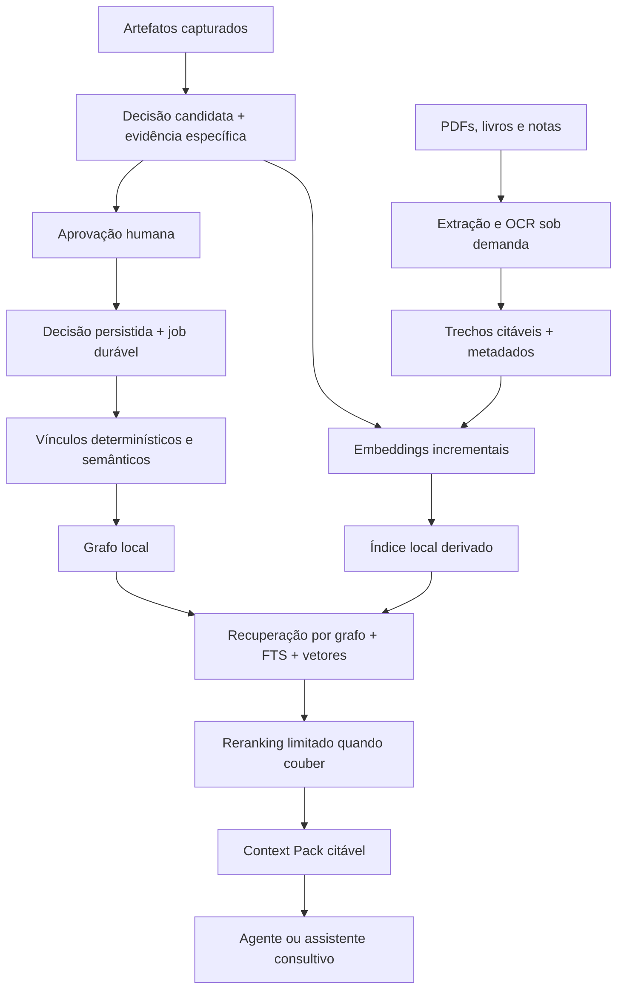

# Memória semântica local first: direção, mercado, custo e latência

**Data:** 2026-09-30

**Pergunta:** como gerar vínculos na aprovação de decisões e preparar a biblioteca
global de PDFs/livros, usando componentes existentes, com custo controlado e
suporte a Windows com 8 GB de RAM e sem GPU dedicada?

**Status:** Aberta

## Direção e limites

O usuário concordou com a direção de automação registrada em
[automacao-do-grafo-fontes.md](automacao-do-grafo-fontes.md): aprovação dispara
vínculos, captura de ferramentas fornece evidência e recuperação combina grafo,
texto e embeddings. Também confirmou o mínimo de **8 GB de RAM, CPU, sem GPU**.
Esta pesquisa seleciona caminhos para experimentar, não instala dependências,
não escolhe fornecedor definitivo e não altera a política de autoridade do domínio.

O vocabulário já prevê Knowledge Library global, Knowledge Source citável e
Engineering Assistant consultivo em [CONTEXT.md](../produto/CONTEXT.md).
Global significa reutilizável entre Projects do usuário, não hospedado publicamente.
Livro consultado não vira regra vigente de projeto por ser encontrado na busca.

Local first mantém a cópia primária e o uso básico na máquina. Rede opcional é
compatível com essa direção; dependência obrigatória de servidor para consultar
os próprios documentos não é o alvo. Fundamentação:
[Ink & Switch, Local-first software](https://www.inkandswitch.com/essay/local-first/).

## O que aproveitar e o que implementar

Não treinar embeddings, implementar transformer, tokenizer ou HNSW à mão.
Usar **modelos pré-treinados + runtime + biblioteca de índice**. Embedding é
produzido por modelo, enquanto busca vetorial e reranking são outras operações.

| Peça | Comprar/reutilizar do ecossistema | Construir no xemnas |
| --- | --- | --- |
| Embeddings | Modelo + tokenizer/pooling/prompts corretos, ONNX/GGUF/runtime | Cache, versão do modelo, fila e interface substituível |
| Índice vetorial | Motor embedded existente | Filtros de Project/Library, integridade com o SQLite e recomposição |
| Busca híbrida | FTS, busca vetorial e fusão de rankings | Política de seleção, validade temporal e orçamento por categoria |
| Reranking | Modelo treinado para relevância de pares | Limite de candidatos, cache, deadline e fallback |
| Documentos | Parser e OCR já existentes | Identidade/versionamento, citações e recuperação de jobs |
| Relações de decisões | LLM ou classificador adequado à relação | Evidência, validações, tipos, ciclos e autoridade |

Um reranker de relevância pode melhorar a ordem de resultados, mas não demonstra
`depends_on`, `conflicts_with` ou `supersedes`. Modelo e evidência específicos
continuam necessários para interpretar essas relações. Rerank processa pergunta
e documento conjuntamente: limitar a poucos candidatos é parte da economia.
Fonte: [Sentence Transformers, Retrieve & Re-Rank](https://www.sbert.net/examples/sentence_transformer/applications/retrieve_rerank/README.html).

## Quatro levantamentos complementares

| Nota | O que responde |
| --- | --- |
| [embeddings-e-reranking-local.md](embeddings-e-reranking-local.md) | Runtimes Rust/Python, modelos compactos, licenças e Windows CPU |
| [biblioteca-e-busca-local.md](biblioteca-e-busca-local.md) | SQLite/vector stores, PDFs/OCR, citações e armazenamento |
| [solucoes-prontas-rag-local.md](solucoes-prontas-rag-local.md) | Produtos locais existentes e frameworks de orquestração |
| Esta nota | Integração, custos comparáveis, latência e experimento mínimo |

## Arquitetura proposta

Separar os espaços de busca de decisões de Project e trechos da Knowledge Library,
mesmo quando usam o mesmo modelo. Restrições vigentes são selecionadas conforme
escopo e tempo, não descartadas porque um trecho de livro tem score maior.

O núcleo Rust controla casos de uso, autorizações, banco e jobs. Portas conceituais
para inferência (`EmbeddingProvider`, `Reranker`), documentos e índice permitem
trocar infraestrutura sem pôr regras de negócio em Python ou na UI. Não implica
criar uma crate para cada interface agora. A fila durável existente em
`crates/application/src/jobs.rs` já oferece um ponto de integração a avaliar.

### Aprovação automática não é execução síncrona de tudo

1. Na extração, preparar relações e embeddings da candidata em segundo plano.
2. Na aprovação, validar a versão aprovada e salvar decisão + intenção durável.
3. Materializar imediatamente o que a evidência permite; trabalhos mais caros
   completam em background, com estado pendente/erro visível e repetição idempotente.
4. Se o usuário editou a candidata, invalidar resultados preparados para outra versão.
5. Consultas usam o estado pronto e informam cobertura insuficiente; não inventam
   vínculos enquanto a inferência está pendente.

Isso evita transformar o clique Aprovar em espera por modelo. A política exata de
vínculos inferidos válidos/pendentes e de substituição deverá ser explicitada na
revisão do ADR-0005. IA propõe contexto e relações; autoridade não vem do score.

## Rust, Python local ou serviço remoto

| Opção | Como roda | Hospedagem | Trade-off |
| --- | --- | --- | --- |
| Rust + runtime embedded | Biblioteca dentro do desktop ou worker binário Rust | Nenhuma | Melhor distribuição integrada; catálogo/formato de modelos precisa ser compatível |
| Componente Python local | Processo filho iniciado pelo app para jobs | Nenhuma | Ecossistema amplo de OCR/modelos; distribuição e memória precisam ser controladas |
| Ollama/servidor local configurado | Serviço na própria máquina do usuário | Nenhuma nuvem obrigatória | Dependência adicional a instalar/configurar; útil como opção de power user |
| API de fornecedor | Inferência remota, armazenamento principal ainda local | Fornecedor cobra uso | Rede, consentimento e indisponibilidade; modelo remoto opcional |
| Backend próprio remoto | Servidor Python/TEI/vLLM em infraestrutura alugada | Custo recorrente + operação | Mais controle central; aumenta responsabilidade e dependência de rede |

**Repositório Python separado é viável, mas não exige backend remoto.** Pode
publicar um worker versionado que o instalador do xemnas distribui. Contrato via
stdio/JSON ou named pipe, IDs de job, cancelamento, limites de memória, protocolo
versionado e processo supervisionado. Um subprocesso é uma exceção consciente
à proposta atual de monólito em um processo; documentá-la em ADR ao escolhê-la.

Evitar exigir `pip install`, ambiente Python do usuário ou Docker no uso normal.
Empacotamento Windows, assinatura, antivírus, bibliotecas nativas, arquivos de
modelo e atualização fazem parte do produto. Download inicial de modelos pode
ser separado do app; após baixar, validação e operação precisam funcionar offline.

Recomendação: testar primeiro inferência compacta pelo caminho Rust existente no
ecossistema; manter Python disponível para parsing/OCR que justifique seu custo.
Não criar o repositório separado antes de comparar os dois caminhos num experimento.

## Custo: separar cinco contas

1. **Indexação inicial:** parsing/OCR, chunking e embedding de conteúdo novo.
2. **Busca:** embedding da pergunta, consulta de índice e rerank de poucos trechos.
3. **Interpretação:** LLM para relações de decisões ou resposta do assistente.
4. **Armazenamento:** originais, texto, vetores, índices e backups.
5. **Distribuição/operação:** manutenção de runtimes/modelos, CI, downloads e,
   apenas se houver nuvem, servidores, observabilidade, proteção e atendimento.

### Preços remotos como referência, não como opção padrão

Preços publicados e conferidos em 2026-09-30, em USD, sem impostos, câmbio,
descontos por lote ou créditos promocionais. Tokens variam pelo tokenizer.

| Serviço/modelo | USD por 1 milhão de tokens processados | Exemplo: 10 milhões de tokens de indexação |
| --- | ---: | ---: |
| OpenAI `text-embedding-3-small` | 0,02 | 0,20 |
| OpenAI `text-embedding-3-large` | 0,13 | 1,30 |
| Voyage `voyage-4-lite` | 0,02 | 0,20 |
| Voyage `voyage-4` | 0,06 | 0,60 |
| Voyage `voyage-code-4` | 0,12 | 1,20 |

Fontes: [OpenAI small](https://developers.openai.com/api/docs/models/text-embedding-3-small),
[OpenAI large](https://developers.openai.com/api/docs/models/text-embedding-3-large),
[Voyage pricing](https://docs.voyageai.com/docs/pricing).
Os exemplos são cálculo próprio, não orçamento para PDF/OCR/LLM nem custo mensal.
O exemplo de 10 milhões já pressupõe tokens efetivamente enviados, incluindo
overlap de chunks; contar o texto bruto uma vez subestima essa sobreposição.

Voyage publica `rerank-3-lite` a USD 0,02 e `rerank-3` a USD 0,05 por milhão
de tokens. A contagem inclui a pergunta repetida para cada documento.
Exemplo calculado: 20 trechos de 400 tokens e pergunta de 50 tokens = 9.000 tokens;
1.000 consultas custariam USD 0,18 no lite ou USD 0,45 no outro, só de rerank.
Fontes: [preço](https://docs.voyageai.com/docs/pricing) e
[contagem/modelos](https://docs.voyageai.com/docs/reranker).

**Cohere e Jina também oferecem embeddings/reranking**, mas as páginas conferidas
não permitiram fixar preço unitário de API comparável. Cohere mostra opções
dedicadas Model Vault por instância; Jina apresenta créditos/top-up dependentes da
conta. Não misturar preço de instância com preço por token nem repetir tarifas
antigas como atuais. Fontes: [Cohere](https://cohere.com/pricing),
[Jina](https://jina.ai/embeddings/).

### Relações semânticas e respostas têm conta separada

Fórmula para uma execução: `(tokens_entrada × preço_entrada +
tokens_saída × preço_saída) / 1.000.000`, além de custos aplicáveis de cache,
ferramentas e repetição. Embeddings baratos não tornam o assistente inteiro gratuito.

Exemplo ilustrativo de relação: 6.000 tokens de entrada + 500 de saída, sem cache,
ferramentas ou retries. A tabela Standard de contexto curto consultada publica:

| Modelo de referência | Entrada / saída por milhão | 1.000 execuções deste exemplo |
| --- | --- | ---: |
| `gpt-6-luna` | USD 0,10 / 0,50 | USD 0,85 |
| `gpt-6.1-sol` | USD 2,00 / 10,00 | USD 17,00 |

Fonte: [OpenAI API pricing](https://developers.openai.com/api/docs/pricing).
Isso não recomenda modelo nem comprova qualidade para relações; mostra o impacto
de escolha e volume. Tokens internos de raciocínio faturáveis podem aumentar a
saída efetiva. Validar capacidades por perfil: não pressupor que a integração
de conta/plano existente também autoriza embeddings ou que os preços de API
se aplicam ao consumo do plano.

### Hospedar um Python nosso é outra ordem de custo

Um worker local tem **USD 0 de aluguel de servidor**, mas usa CPU, RAM, disco,
energia e manutenção. Exemplo energético apenas aritmético: 25 W incrementais
durante 2 h = 0,05 kWh; multiplicar pela tarifa local. Não é medição deste app.

Como referência remota, Runpod publica RTX 4090 em Pods a USD 0,74/h. Manter
essa instância por 720 h dá USD 532,80/mês de compute, antes de storage e outros
custos. Não é um requisito para embeddings compactos; é um exemplo de por que
evitar GPU própria sempre ligada para uso pessoal.
Fonte: [Runpod pricing, atualização 2026-09-27](https://www.runpod.io/pricing).

Modal publica T4 a USD 0,000164/s: 100 h efetivamente cobradas dão USD 59,04
de GPU, além de CPU/memória/storage. Escalar a zero evita residência contínua,
mas partidas frias e carga de modelo entram na engenharia de latência.
Fonte: [Modal pricing](https://modal.com/pricing).

Qdrant Cloud tem tier gratuito limitado para testes; plano pago depende de
recursos. Não precisamos dele para índice embedded. Serviço gerenciado de busca
também é uma conta distinta da inferência.
Fonte: [Qdrant pricing](https://qdrant.tech/pricing/).

## Latência: três caminhos diferentes

| Caminho | Trabalho permitido | Política proposta |
| --- | --- | --- |
| Contexto no plugin | Grafo/FTS prontos; embedding apenas se couber/cache disponível | Priorizar cobertura pronta, fallback e deadline |
| Assistente dentro do app | Recuperação híbrida, rerank e geração de resposta | Streaming, cancelamento e orçamento de contexto |
| Background | OCR, importação, embeddings em lote, inferência de relações | Progresso persistido, pausa e prioridade menor que consulta |

**Limite real do código:** `adapters/opencode/src/config.ts` define
`DEFAULT_CONTEXT_TIMEOUT_MS = 300`. Esse timeout inclui comunicação e trabalho
do app. Não inserir automaticamente rerank, cold start ou LLM nesse caminho.
Modelos devem ser aquecidos fora da requisição, e a busca rápida por arquivo deve
continuar útil sem vetores. Eventual alteração de timeout é decisão medida,
não consequência automática de escolher embeddings.

Local elimina viagem de rede, mas não garante baixa latência: modelo frio,
tokenização, tamanho dos trechos, paginação de memória, OCR simultâneo e índices
sem otimização podem dominar. Rerank tem custo por par e costuma ser a etapa
mais cara da recuperação; não rodar sobre toda a biblioteca.

Para 8 GB: não manter OCR, embedding, reranker e LLM grande residentes juntos;
usar workers com limites, pequenos lotes, filas por prioridade e descarregamento
de modelos. Buscar antes de terminar toda a importação, indicando o que já está
indexado. Um assistant de alta qualidade inteiramente local em qualquer CPU/8 GB
não foi demonstrado nesta pesquisa; separar requisito de recuperação offline da
qualidade/velocidade da geração, que pode usar perfil opcional remoto.

## Experimento mínimo antes de fechar a stack

**Candidatos:** embeddings compactos multilingual E5-small e EmbeddingGemma
quantizado; FastEmbed Rust versus worker Python apenas onde necessário.
Índice inicial SQLite + FTS5 + extensão vetorial documentada, comparado com
LanceDB embedded. Alternativas recentes e experimentais ficam na nota de índice.
Rerank é opcional e só entra se melhorar relevância respeitando memória/deadline.

**Corpus:** decisões reais anonimizadas, PDFs textuais e escaneados, português,
inglês, código e tabelas. Escalas de 1.000 decisões e 10.000/100.000 chunks.
Incluir decisão sem diff, mesma captura com dois assuntos, conflito real,
decisões semelhantes compatíveis, fontes antigas e atualização de modelo.

**Medir:** cold start, p50/p95 por etapa e ponta a ponta, pico/idle de RAM do
conjunto desktop+workers, arquivo de modelo/download, tempo de importação,
chunks/s, tamanho em disco, Recall@k, nDCG@k, citações corretas e relações
falsas. Rodar com rede desligada e uso concorrente representativo na máquina
de 8 GB; sem esse teste não declarar compatibilidade do produto inteiro.

**Metas propostas, não resultados medidos:** contexto rápido concluir antes
do limite de 300 ms; consulta interativa recuperar evidências úteis sem bloquear
a interface; OCR/importação canceláveis. Definir envelope de RAM após medir o
desktop atual e a memória disponível com SO/editor abertos. Modelo que cabe no
arquivo de disco não necessariamente cabe no envelope de RAM.

**Migração:** embeddings e índice são derivados reconstruíveis. Identidade do
modelo inclui revisão, tokenizer, prompts, pooling, dimensão e quantização.
Troca incompatível cria índice novo, backfill em background e troca atômica;
consulta nunca mistura vetores incompatíveis nem embeddings de provedores
diferentes só porque têm a mesma dimensão.

## Conclusão de trabalho e validação

A direção recomendada é **recuperação local compacta, automação incremental e
Python local opcional para documentos**, com nuvem por escolha de perfil.
O custo de geração/classificação e o peso de OCR merecem tanta atenção quanto
embeddings. Não há motivo técnico para reinventar os algoritmos de inferência
ou para alugar servidor só por decidir usar Python.

A pesquisa original foi documental. O [benchmark Rust CPU](benchmark-semantico-local.md)
executou E5-small/Gemma Q4 e SQLite/FTS5/sqlite-vec versus LanceDB embedded,
em Linux/WSL2 limitado a 8 GiB. Ele favoreceu SQLite para o índice inicial;
E5 para velocidade e Gemma para RAM e recuperação. Na fixture, a fusão RRF
uniforme piorou a qualidade e embeddings colocaram escolhas opostas em primeiro
lugar: combinação de rankings e validação de relações continuam hipóteses a
avaliar, não políticas aprovadas pelo experimento.

Windows físico de 8 GB, integração no app, OCR, reranking e geração por LLM
continuam **não validados**. Documentos foram adiados. Preços e branches
consultados podem mudar; a próxima decisão técnica deve usar os resultados
e atualizar os documentos normativos pertinentes.
