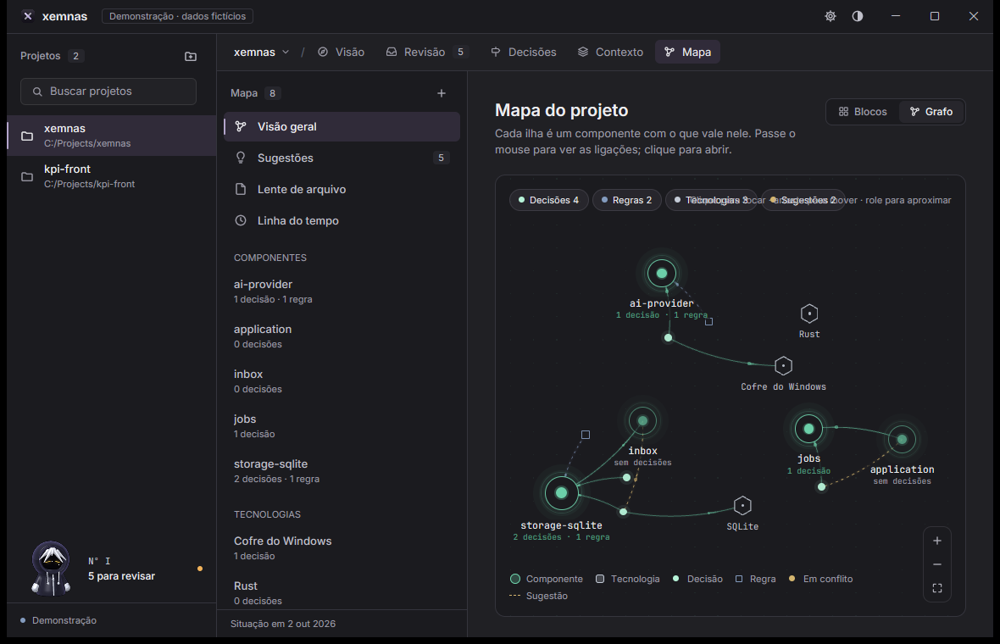
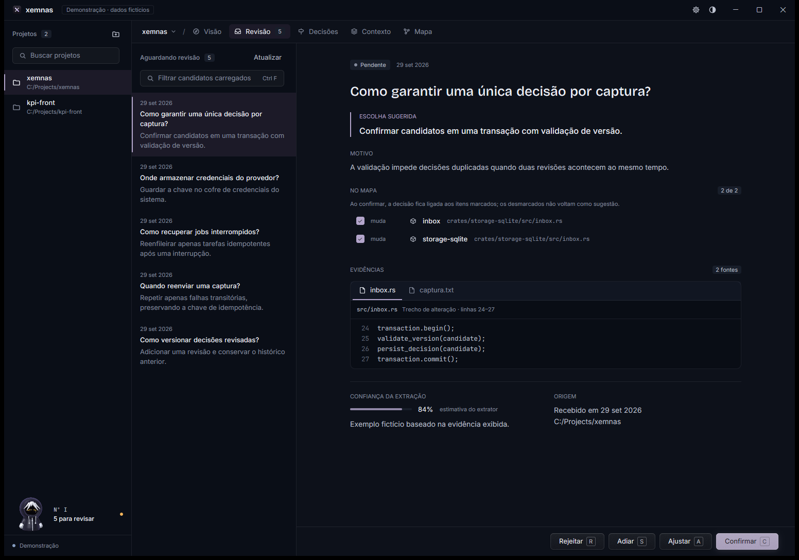

# Plano para o Xemnas virar uma vitrine de produto desktop

**Data:** 02/10/2026.
**Pergunta:** como elevar o acabamento e a experiência do Xemnas usando referências
GPUI e produtos de ponta, sem perder sua personalidade nem sua autoridade humana?
**Status:** Em implementação. Etapas 1 e 2 em boa parte entregues (colisão do
cabeçalho do grafo, Blocos virtuais, panorama, Barnes–Hut, modo barato); etapas
3 a 5 e as decisões pendentes abertas. `tools/capture-vitrine.ps1` captura as
cenas do roteiro. Capturas reais de demo inspecionadas; sem teste com usuários.

## Direção recomendada

Elevar o Quiet Glass existente: leitura editorial precisa, navegação que recua,
evidência que se entende imediatamente e um mapa que responde e explica. A vitrine
deve mostrar o ciclo **captura → revisão humana → decisão com evidência → contexto
útil**, além de um grafo bonito. Fluidez em dados grandes faz parte do acabamento.

As referências e suas fontes estão no
[catálogo de design](design-vitrine-fontes.md). A pesquisa de desempenho está em
[escalar grafos e blocos](escalabilidade-renderizacao-fontes.md), commit `26494ee`.
O plano é exploratório; as regras continuam em
[VISUAL-IDENTITY.md](../design/VISUAL-IDENTITY.md), com a precedência de
[docs/README.md](../README.md). Nenhuma tela de produção foi alterada.

O [refresh do Linear de março de 2026](https://linear.app/now/behind-the-latest-design-refresh)
é uma referência adequada para reduzir o peso da navegação e tornar cabeçalhos
previsíveis. Adaptar esse princípio à nossa gramática, sem copiar paleta ou
dimensões. O Xemnas já tem boa base: identidade, tipografia de leitura, evidência
em painel sólido, uma ação primária e assinatura de marca discreta.

## Evidência atual e limites

Base: `7cb779a9754ae2ff51d6c629b6c14f3e38c7440c`. Build Windows:
`cargo build --locked -p desktop-gpui --bin xemnas`, aprovado nesta sessão.
Capturas do binário recém-gerado com `--demo --background --open`, PrintWindow,
sem foco/cliques/teclas. A cópia temporária do script de captura adicionou
`-WindowStyle Hidden`; o script versionado não foi alterado.

Paletas: Quiet Glass em 1552 × 1088 e Carvão em 1180 × 760. Esses são tamanhos
da imagem da janela, não uma medição da área útil em pontos lógicos. Dados demo
são fictícios e estão identificados pelo próprio aplicativo. Imagens não provam
latência, navegação por teclado, leitura com leitor de tela ou contraste numérico.
Não foi feito um teste sequencial de todas as ações; são estados alcançados por
rotas de demo. Não chamar esta inspeção de auditoria completa do fluxo.

| Estado capturado | O que se pode observar | Implicação para o plano |
| --- | --- | --- |
| [01 Revisão](assets/vitrine/research-review.png) | Pergunta, escolha, motivo, evidência e Confirmar têm ordem clara; listas mostram títulos e resumos longos | Preservar o leitor e melhorar ritmo da lista em escala |
| [02 Decisões](assets/vitrine/research-decisions.png) | Versão, estado, contexto e fontes distinguem uma decisão durável | Fazer versão e procedência serem fáceis de comparar sem abrir tudo |
| [03 Blocos](assets/vitrine/research-blocks.png) | Três raízes em duas colunas, chips de partes e tecnologias; muita área livre num mapa pequeno | Não preencher o vazio com métricas inventadas; usar profundidade progressiva no mapa grande |
| [04 Grafo](assets/vitrine/research-graph.png) | Formas tipadas, legenda discreta, ilhas e destaque verde já criam assinatura | Preservar a assinatura e introduzir escala sem perder significado |
| [05 Grafo compacto](assets/vitrine/research-graph-charcoal-compact.png) | Dica de interação sobreposta aos chips; os dois trilhos laterais ocupam grande parte da largura | Corrigir conflito real do cabeçalho antes de adicionar controles |
| [06 Revisão compacta](assets/vitrine/research-review-charcoal-compact.png) | Pergunta quebra em duas linhas; leitor fica estreito e exige rolagem; rodapé continua acessível | Provar evidência e ação em altura curta; testar o modo foco já existente |
| [07 Visão](assets/vitrine/research-overview.png) | Resumo com fontes, alerta de defasagem e fluxos em lista já demonstram o produto | Usar como abertura da narrativa, não criar dashboard paralelo |
| [08 Aparência](assets/vitrine/research-appearance.png) | Temas em rádio e miniaturas de fundo explicam personalização | Consolidar o acabamento comum às cinco paletas antes de novos efeitos |
| [09 Grafo em foco](assets/vitrine/research-graph-focus.png) | Vizinhos permanecem acesos e o painel lista relações; uma regra longa aparece abreviada | Usar foco como segunda cena e validar acesso ao texto completo |
| [10 Contexto](assets/vitrine/research-context.png) | Entregas agrupadas por dia, estado Enviado/Medido e orçamento real por bloco | Mostrar como decisões se tornam contexto enviado ao agente |

### Dois estados que orientam a prioridade

**Achado comprovado:** dica absoluta e filtros colidem na imagem 05. **Hipótese
de UX:** a largura conjunta dos trilhos dificulta a tarefa em janela compacta;
validar com tarefas e modo foco, sem assumir que dois trilhos são sempre ruins.
Espaço vazio em dados pequenos é uma escolha válida, não defeito por si só.

## O que preservar e o que elevar

| Preservar | Elevar |
| --- | --- |
| Quiet Glass, lavanda de ação/foco e verde restrito ao grafo | Hierarquia consistente entre lista, leitor e canvas |
| Inter para ferramenta e Bricolage só para marca/pergunta | Ritmo de títulos, metadados, path e evidência longa |
| Uma coluna de leitura de até 760 px | Adaptação ao espaço restante e reflow seguro |
| Rodapé de ações, estados completos e seleção com barra | Mesma localização das ações e feedback em todas as telas |
| Formas tipadas e layout estável do mapa | Navegação por escala, foco e agrupamentos explicados |
| Mascote discreto no pé da lateral | Estados úteis e movimento que estaciona |
| Evidências reais e confirmação humana | Procedência legível na lista, detalhe, histórico e contexto |

## Plano por superfície

### Shell, navegação e cabeçalhos

1. Inventariar o cabeçalho de cada destino: localização/projeto, título da visão,
   filtro e ação. Padronizar alinhamentos e a hierarquia nas peças compartilhadas.
   Não transformar as cinco abas em destinos novos ou alterar atalhos por estética.
2. Corrigir o cabeçalho do grafo: reservar uma linha de layout para controles,
   permitir quebra/colapso dos chips e levar a dica a uma região sem disputa.
   Na largura curta, texto de ajuda pode virar tooltip acessível. Tooltip sozinho
   não substitui o nome acessível nem uma ajuda descoberta por teclado.
3. Primeiro testar o modo foco existente (`Ctrl \`) e sua descoberta. Se for
   insuficiente, propor navegação adaptativa: preservar a lista da tarefa e
   recolher o trilho de projetos com retorno explícito. Essa mudança de shell
   exige desenho e aprovação explícitos; não criar uma variante local do Mapa.
4. Persistir somente preferências necessárias; não esconder automaticamente uma
   navegação sem indicação nem mover o foco para uma área que desapareceu.

Referência: [Linear: alinhamento e hierarquia de navegação](https://linear.app/now/how-we-redesigned-the-linear-ui).
Implementação futura: `app.rs`, `ui::patterns`, `ui::motion::glide`,
`ui::controls`, paleta e atalhos em `main.rs`. Dimensões vêm de tokens;
breakpoints serão escolhidos por conteúdo/medição, não números inventados aqui.

### Revisão: a tela que vende o valor

- Manter pergunta → escolha → motivo → mapa → evidência → confirmação.
- Na lista, data e origem secundárias, título principal e resumo com limite
  visual previsível; pergunta inteira no leitor. Contagem e paginação reais.
- Evidência com arquivo, trecho, linhas e navegação sem ocultar o fundamento.
  Revisar o comportamento de trechos longos, múltiplas fontes e caminhos extensos.
- Mostrar carregamento/erro da ação perto da região que age; evitar clique duplo
  e preservar contexto quando falha. Confirmar continua sendo decisão humana.
- Primeiro validar o que existe. A compactação da lista deve reutilizar padrões
  compartilhados e não apagar informações necessárias para distinguir candidatos.

Peças: `screens/inbox.rs`, `screens/evidence`, `reading_page`, `reading_title`,
`action_footer`, `mark_selected`, `skeleton_list`, `error_banner`, `toast`.
Aceitação: revisar um candidato inteiro com mouse e teclado, consultar ambas as
fontes e cancelar um ajuste sem perder o candidato; nenhum atalho de letra
dispara enquanto `SearchField` estiver em foco.

### Decisões: documento durável, histórico visível

- Preservar versão/data/estado e a escolha como núcleo do leitor.
- Uniformizar divulgação progressiva de escopo, premissas e consequências;
  o conteúdo escondido precisa ter rótulo e quantidade reais.
- Reduzir esforço para comparar versões por mudanças e evidência. Uma comparação
  lado a lado é hipótese de evolução, condicionada ao caso de uso do backend e
  ao espaço; em janela curta, preferir comparação sequencial legível.
- Unificar ações existentes com o rodapé de superfície onde a regra vigente
  exige; não espalhar uma segunda ação primária no mesmo leitor.

Peças: `screens/decisions.rs`, `screens/evidence`, `section_header`, `tag`,
`status_pill`, `kbd`. Histórico já existe; diff semântico de versões só entra
depois de contrato do `application`, sem calcular negócio na UI.

### Mapa em blocos: arquitetura legível em qualquer volume

- Virtualizar linhas de dois blocos, respeitando altura igual dentro da linha e
  altura variável entre linhas. Manter a coluna de leitura; rolar não monta todos.
- Pré-agrupar partes no read model apropriado; evitar percorrer todas as entidades
  em cada card durante `render`. Filhos abundantes precisam de expansão/detalhe,
  não milhares de chips dentro de um card.
- Explicitar raiz, partes, tecnologias e relações confirmadas. Contagens agregadas
  são distintas de itens carregados. Um agrupamento visual não cria entidade real.
- Busca/filtro precisa informar escopo: carregados ou projeto. Pesquisa global
  depende de caso de uso, cursor e revisão consistente no backend.
- Sem “pontuação de saúde” ou progresso inventado; âmbar só quando existe conflito
  ou aviso real. Manter abrir bloco → detalhe → decisão como percurso principal.

Peças: `screens/map.rs`, listas GPUI da revisão fixada, `section_header`,
`count_chip`, `empty_panel`; backend `application::graph`.
Aceitação: 10 mil itens exploráveis é alvo de benchmark, não promessa de 10 mil
cards simultâneos. Scroll, teclado, posição preservada e descoberta do último
resultado entram no teste.

### Grafo: assinatura visual com exploração útil

Três escalas propostas, sujeitas à revisão da regra visual:

| Escala | Informação | Interação |
| --- | --- | --- |
| Panorama | Componentes e ligações agregadas com contagem verdadeira | Buscar, filtrar e aproximar uma região |
| Região | Entidades e principais ligações daquele escopo | Selecionar componente/hub sem relayout global |
| Foco | Nó, relações tipadas, decisões/regras e fontes | Abrir detalhe ou decisão, voltar mantendo a câmera |

O plano não troca formas/cor de estado já aprovadas. Define detalhe por zoom,
limite de rótulos/arestas e animação focada. Agregação precisa mostrar o que
representa e permitir expandir; seleção e conflito têm prioridade sobre decoração.
Recortes espaciais devem preservar curvas que cruzam o viewport, mesmo com ambos
os extremos fora dele. O grafo não pode afirmar ausência de relação quando só
reduziu detalhes ou carregou parte dos dados.

[Obsidian](https://obsidian.md/help/plugins/graph) é referência de filtros,
grafo local e controle de exibição, não referência de autoridade das relações do
Xemnas. Evitar transportar grupos coloridos arbitrários para o produto.
`GraphCanvas` permanece responsável por câmera, pintura e interação; consultas
e significados continuam no `application`. Detalhe textual deve oferecer caminho
equivalente para teclado/leitor de tela. Minimap é opcional, só se resolver
orientação em testes; não é item obrigatório de acabamento.

### Visão, Contexto e Configurações

- Visão abre a narrativa com resumo citável e fluxo; destacar defasagem real sem
  dominar a tela. Não duplicar mapa/decisões como novos cartões de dashboard.
- Contexto encerra a narrativa: o que foi entregue, orçamento real, itens e origem.
  Erro/estado Medir/Ativo precisa ser compreensível antes da configuração.
- Configurações conservam rádio em lista, painéis e status line. Validar nomes,
  mensagens, caminho e seletor de arquivo em largura curta e nas cinco paletas.
- Tema e fundo nunca comprometem código/evidência. Glass opcional é acabamento
  posterior; a legibilidade da base opaca continua sendo o gate.

### Paleta, ações e microinteração

A [Action Panel do Raycast](https://manual.raycast.com/action-panel) inspira ações
contextuais descobertas por teclado. O Xemnas já reserva `Ctrl K` à paleta; não
copiar o atalho para abrir outro painel concorrente. Começar organizando comandos
existentes por destino/ação e exibindo os atalhos reais; busca além do carregado
é uma proposta backend posterior. Foco retorna ao gatilho quando um popover fecha.

O [trabalho de foco do Zed](https://zed.dev/blog/settings-ui) é referência de
implementação GPUI. Conferir APIs na revisão usada pelo produto antes de importar
código. O catálogo `ui::motion` já existe: usar suas curvas, clock, lease,
reduce_motion e fases de saída, sem novo loop infinito de animação.

## Execução em mudanças pequenas

Esforços são relativos, não prazos. Backend e front mantêm sessões/branches
separadas; os contratos da fase técnica precedem telas que precisam deles.

| Etapa | Entrega | Dependência | Gate | Esforço |
| --- | --- | --- | --- | --- |
| 0 — baseline | Capturas catalogadas, tarefas e spans de performance | Já iniciado nesta pesquisa | Reproduzir baseline e falha real em grande volume | Baixo |
| 1 — precisão | Corrigir colisão de header, revisar alinhamentos, foco/tooltip e estados existentes | Padrões atuais | Sem colisões nos dois tamanhos e cinco temas | Baixo/médio |
| 2 — fluidez | Grafo sob demanda/background, virtualização dos blocos, culling/LOD | Plano técnico e contratos backend | Benchmark em 2.500/10.000, sem bloqueio UI | Alto |
| 3 — tarefa | Leitor/evidência e lista consistentes; descoberta de modo foco | Etapas 1/2 | Completar revisão e abrir fonte sem perder contexto | Médio |
| 4 — exploração | Panorama/região/foco, busca por escopo, comparação de versões se justificada | Read models; aprovação das mudanças de padrão | Contagens e relações verdadeiras, foco/posição preservados | Alto |
| 5 — vitrine | Roteiro e capturas finais do produto já funcional | Gates anteriores | Demo fiel, sem mocks usados como prova de produção | Médio |
| Condicional | Blur/fork, shader, minimap ou shell adaptativo | Evidência de necessidade e proposta explícita | Benefício mensurável acima de custo/risco | Alto |

Uma entrega de UI deve incluir seus estados, acesso pela paleta, atalhos,
validação e documentação no mesmo commit. Separar por assunto, não espalhar uma
tela incompleta por vários commits. Padrão novo vai em `ui::patterns` e
`VISUAL-IDENTITY.md`; pesquisa implementada é removida com seus assets exclusivos,
salvo fundamento citado por regra vigente. Não declarar tickets fechados antes
de implementar e validar.

## Roteiro de vitrine de aproximadamente 90 segundos

1. **Visão (15 s):** identificar o projeto e ler um resumo com fontes.
2. **Revisão (25 s):** abrir uma pergunta, conferir código/evidência, ajustar se
   necessário e confirmar. A nova decisão precisa aparecer de verdade.
3. **Decisão (15 s):** mostrar justificativa, escopo e versão preservada.
4. **Mapa (20 s):** achar seu componente em blocos, mudar para grafo e focar sua
   vizinhança, mantendo o mesmo significado.
5. **Contexto (15 s):** mostrar uma entrega auditável ao agente, com orçamento e
   decisões usadas. Não fingir uma entrega se ainda não ocorreu.

Este é um roteiro proposto, não uma gravação realizada. Para demonstração pública,
usar projeto demo explicitamente identificado ou dados reais saneados. Preparar
uma segunda tomada com volume grande e uma terceira em janela compacta; a vitrine
precisa mostrar uso, não apenas uma tela imóvel com pouco conteúdo.

## Critérios de produto e qualidade visual

- **Correção:** confirmar continua humano; nenhuma informação sintética aparece
  como produção, nenhum limite/LOD omite dados silenciosamente.
- **Leitura:** nome/caminho longo, fonte múltipla, evidência extensa, título com
  pontuação e chips não cortam conteúdo necessário sem alternativa acessível.
- **Espaço:** testar padrão/compacto, resize contínuo, DPI 100/125/150/200% e
  texto grande. Não chamar as capturas desta pesquisa de validação dessa matriz.
- **Estados:** vazio real, carregando, erro recuperável, retry, cancelamento,
  sucesso e operação em curso nos destinos relevantes; só ações reais.
- **Acessibilidade:** Tab/Shift Tab, seleção sob hover, foco visível, Esc,
  atalhos fora de campos, nomes acessíveis e caminho textual equivalente ao
  canvas. Testar leitor de tela; screenshots não provam compliance.
- **Temas:** Quiet Glass, Carvão, Organização, Musgo e Meia-noite; contraste
  automatizado e inspeção do binário novo. Tema opaco primeiro; imagem/glass
  acrescentam cenários de fundo claro/escuro e legibilidade.
- **Movimento:** reduzir movimento, CPU ociosa e ausência de redraw contínuo
  quando oculto. Efeito de sinal no grafo deve caber no orçamento de frame.
- **Desempenho:** adotar o protocolo técnico e medir antes/depois por etapa;
  não substituir medição por captura demo ou alegação de “GPUI é rápido”.

Tarefas de dogfood propostas: revisar candidato com duas fontes, encontrar uma
decisão antiga, explicar uma relação do mapa, confirmar o que o agente recebeu
e voltar ao projeto anterior. Registrar tempo/erros/confusões localmente, com
baseline e nova versão. Cinco participantes seriam uma exploração útil, não
uma amostra estatística nem requisito para corrigir a colisão já comprovada.

## Decisões pendentes, sem bloquear o plano

- Aprovar ou rejeitar shell adaptativo depois do teste do modo foco atual.
- Escolher limiares/representação da agregação após benchmark e teste de leitura.
- Pedir ao backend busca global, páginas/revisões e diff de versões somente se
  os percursos mostrarem necessidade; não simular esse contrato na UI.
- Comparar referências GPUI na versão escolhida e licença antes de portar código.
- Decidir se blur real traz benefício suficiente para financiar fork. A pesquisa
  [Zeron/fork](gpui-zeron-e-fork.md) existente já recomenda prudência; não reabrir
  a decisão apenas porque uma referência usa vidro.

Não há mockup escolhido, protótipo publicado, benchmark integrado aprovado ou
mudança de identidade nesta entrega. As imagens mostram o aplicativo atual.
